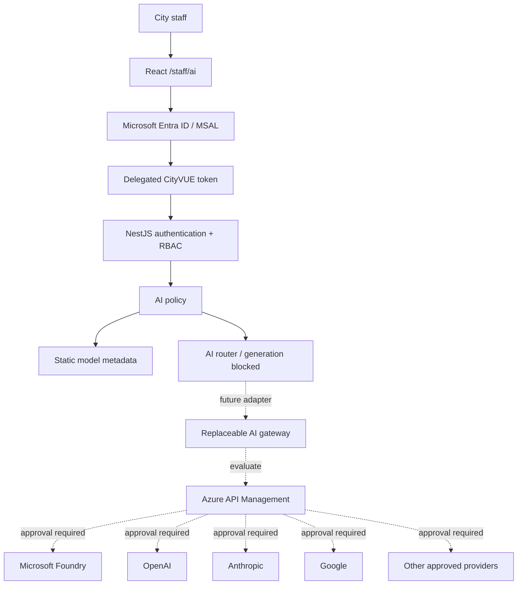

# F020 — Enterprise AI Workspace Foundation

**Status:** Local foundation implemented; no live provider, production activation, or deployment.
**Product:** CityVUE. This workstream is separate from resident conversational assistance.
**Decision:** [ADR-001](../decisions/ADR-001-provider-neutral-staff-ai-gateway.md).
**Security standard:** [CityVUE Security Framework](../security/SECURITY_FRAMEWORK.md).

## Purpose and scope

Establish a City-managed, staff-only workspace with City Entra identity and a provider-neutral backend. Employees may eventually use approved models through one governed interface. F020 implements only authentication/permission boundaries, configuration, safe metadata APIs, neutral contracts, policy/routing foundations, and an inert React page.

No vendor is approved by inclusion in this architecture. F020 does not perform inference, collect prompts, enable chat, upload files, store conversations, retrieve City data, provision resources, or change hosting/DNS. Resident ServiceRequests, Alerts, Issues, CRM and public navigation remain separate. The existing auth layer still reads its RBAC database; the AI domain itself has no database access.

## Repository integration

React 19/Vite uses React Router lazy routes, Bootstrap semantic theme classes, MSAL context, and the shared API client. NestJS 11 uses isolated modules, strict TypeScript, global Joi configuration, a fixed `api/v1` prefix, Swagger DTOs, Helmet, throttling, server-generated correlation IDs, sanitized Pino logs, and the existing exception filter. PostgreSQL/Kysely stores Organization-owned identities and role grants.

F020 extends these patterns. It adds no dependency or model/history table. A data-only Kysely migration adds two permission catalog entries to the F018 schema; it assigns no roles or people. Existing modifications, including unfinished F018 work, are prerequisites rather than replacements.

## Staff/public and identity boundaries

`/staff/ai` is a lazy staff route in the existing app layout. It has no public navigation entry. Direct anonymous visits receive sign-in guidance; legacy or unconfigured Entra mode receives a controlled disabled state. The strict AI route explicitly opts out of the legacy guard's local fallback.

The API uses existing token verification: tenant-specific signature/JWKS, issuer, audience, lifetime, tenant and delegated scope, followed by pre-provisioned active StaffIdentity mapping and database-owned permissions. Identity and Organization come from the server, never request fields. MSAL obtains only a CityVUE API access token; the browser never receives provider credentials. Live token UAT remains dependent on the pending F018 administrator consent.

`RequireEntra` metadata on the AI controller prevents the existing development fallback, even when local staff-action/read flags are enabled. Policy independently rejects development identities or missing identity/Organization context. Other existing staff routes retain their prior fallback behavior.

Permissions:

| Key | Meaning |
| --- | --- |
| `ai.workspace.access` | Read AI status/model metadata; required for future workspace use |
| `ai.administration.access` | Separate future administration boundary; policy also requires workspace access |

These are application permission keys, not invented Entra app roles or approved City grants. No one gets AI access automatically, including service-request supervisors. Administration endpoints/UI are deferred. Future administrative operations must invoke the administration policy check and their own endpoint permission guard. Department/Division membership does not grant AI access; department, group, quota and sensitivity rules require later approved policy.

## Implemented API and feature flags

| Endpoint | Authorization | Behavior |
| --- | --- | --- |
| `GET /api/v1/ai/status` | Entra + workspace permission | 200 with `enabled`, `chatEnabled: false`, `availability: unavailable` |
| `GET /api/v1/ai/models` | Entra + workspace permission | 503 while disabled; 200 empty list when enabled |
| Chat/upload/admin routes | None implemented | No operation exists |

Success responses carry `Cache-Control: no-store`. Existing sanitized 401/403/503/500 envelopes and generated `x-correlation-id` behavior remain. OpenAPI declares bearer authentication, DTOs and expected errors. The existing global rate limiter remains active.

| Server setting | Default | F020 validation |
| --- | --- | --- |
| `AI_ENABLED` | false | Boolean; true requires complete existing Entra configuration |
| `AI_CHAT_ENABLED` | false | Only false accepted; true fails startup |

Effective configuration hardcodes chat off as a second stop. There is no default model, provider URL, provider key or browser AI enable flag. Browser data comes from the authenticated API. Missing configuration fails closed. Setting AI_ENABLED only permits metadata access; it cannot activate inference. Production configuration, role grants and deployment are not changed by this work.

For a separately authorized local metadata check: complete the F018 setup/consent and provisioning, apply the F018 and F020 migrations to the intended local database, explicitly grant workspace permission through existing Organization-owned RBAC, configure React's existing API/Entra settings, and set server AI_ENABLED=true. Keep AI_CHAT_ENABLED=false. No provider setup is needed. Do not use a synthetic development identity to bypass Entra.

The migration rollback intentionally fails on existing permission grants through foreign keys. Remove grants only through an explicitly authorized RBAC change before rollback; the migration never silently revokes them.

## Domain, registry and policy

`server/src/ai` owns CityVUE message, explicit selection, model descriptor, request context, response, usage, and provider contracts. A provider accepts a CityVUE request/context and returns CityVUE content/status/usage. Vendor payloads, endpoint details and credentials belong inside future adapters. Token usage is optional because providers differ.

The registry is static and empty: no model/provider is approved or enabled. Descriptors represent internal ID, display name, provider ID, description, enabled/availability, capabilities, and a nullable classification-policy reference. No City classification taxonomy is invented. API projection explicitly enumerates metadata fields instead of serializing registry internals.

Policy handles staff admission, distinct administrative authorization, feature availability, and explicit model eligibility. Generation checks reject unknown, disabled, unavailable or unclassified models and unsupported capabilities. A final hard stop denies all generation in F020, even with a test-injected enabled model.

The router exposes one generation boundary and always calls policy itself. Callers cannot pass a boolean “authorized” switch or bypass policy by invoking the router directly. No providers are registered, exported or dispatched; there is no network client in the AI domain. A redundant router stop remains if policy behavior changes. The explicit-selection discriminated union can later add an approved `auto` variant, but no automatic routing exists now.

## Architecture and gateway direction

Solid arrows are implemented foundations; dotted arrows are future evaluation only.



Azure API Management is an intended evaluation target, not a selected SKU, verified capability matrix or production dependency. Microsoft Foundry and named providers are candidates only. Verify supported stable APIs, commercial terms, data location, security and gateway behavior during the future evaluation. No preview functionality is required; no Azure resources, IaC, subscriptions, accounts or DNS are created. The provider interface allows replacing gateway technology without changing React or CityVUE domain contracts.

An eventual `ai.rockvillemd.gov` host is a possibility, not current hosting configuration.

## Logging, privacy, classification and secrets

Ordinary logs must never include full prompts, responses, document contents, tokens, credentials, claims or vendor exceptions. F020 adds no prompt/response logging and exposes no prompt submission endpoint. Existing allowlisted HTTP logs provide server correlation, route template, method, duration and result status; request bodies, response bodies, raw URLs/query strings and headers are excluded.

Future metadata such as pseudonymous staff ID, internal model/provider ID, latency, usage and estimated cost requires explicit sanitizer allowlist changes and tests. Do not assume these fields are currently logged. Restrict telemetry access and retention; operational telemetry is not a records-retention or audit solution. Existing logger limitations described in the security framework remain.

Classification/DLP, allowed data classes, provider-specific processing terms, region, residency, retention, training exclusions and acceptable uses need City review before any inference. A null classification policy grants no processing permission. No data classification or retention period is asserted as City policy here.

Provider secrets must remain in approved server-side secret management (for example a separately approved Key Vault/managed-identity design). No Vite secret values, browser service credentials, shared AI usernames/passwords, consumer logins or local AI passwords. Rotate and scope credentials per environment/provider under future operations policy.

## Future conversations and files

Conversation history is deliberately absent from SQL, localStorage and sessionStorage. The disabled textarea accepts no input. Future persistence requires explicit retention rules, encryption in transit/at rest, Organization/user access controls, deletion behavior (including backups and legal holds), records-management review, and privacy/security review. Do not reuse general-purpose tables for AI content.

No AI file upload exists. The future required pipeline is:

```text
Upload -> file validation -> malware scanning -> classification/DLP
       -> approved secure storage -> approved AI processing
```

File types/sizes, quotas, scanning failures, quarantine, access, deletion and provider transfer policy must be approved before implementation. Failure must block processing.

## Future City-system integrations and threat boundaries

No AI access to VUEWorks, MGO, ArcGIS, SharePoint, Outlook/Exchange, resident requests or application databases. Future tools use explicit least-privilege APIs and independently enforce caller and Organization scope. An AI model never receives unrestricted database access.

| Threat boundary | F020 control / future requirement |
| --- | --- |
| Anonymous/resident to staff | Strict UI admission plus server Entra and permission guard |
| Signed-in employee to AI | Explicit database-owned workspace permission; no implicit role grants |
| Employee to administration | Separate permission and policy method; no admin operation exists |
| Browser to API | Existing token validation, CORS, Helmet, throttling, safe errors |
| API to provider | No dispatch/client/credentials now; future policy, gateway, egress allowlist and secrets |
| Organization to Organization | Existing server identity mapping; future policy/storage/tools must preserve scope |
| Content to logs/storage | No content ingestion/persistence; existing logging allowlist tested |
| Untrusted model/tool output | Future prompt-injection defenses, output handling and tool authorization; model output cannot grant authority |

The router is an application boundary, not a sandbox for arbitrary trusted-server code. Adding a network-backed adapter is a new security-sensitive feature that must remove the hard stop only after approved policy and new adversarial tests. Unit network spies are a regression check, not infrastructure egress enforcement.

## Testing and validation

Unit tests cover safe configuration, invalid/forbidden activation, strict staff admission, distinct administration permission, empty registry, secret-free projections, disabled/unknown models, policy invocation and no generation/network dispatch.

HTTP tests use real Nest routing, guards, middleware, exception filtering, DTO/OpenAPI and policy, with token validation and StaffIdentity resolution replaced by deterministic fixtures. They test anonymous/invalid-token/missing-scope/unprovisioned/unauthorized identities, disabled flags, metadata, sanitized dependency failure, correlation and content-free logs. Existing F018 token tests cover cryptographic validation; this is not live Entra UAT.

React tests cover strict route admission, server denial, disabled/empty state, labelled disabled controls, session/account changes, authenticated API reads and unchanged resident navigation. Existing Node, React, backend unit/E2E, TypeScript, lint and builds remain regression gates. Real PostgreSQL tests require TEST_DATABASE_URL. See the implementation validation report for exact outcomes and skips.

## Subsequent governance and provider phases

1. Complete Entra consent and live staff authorization UAT; approve AI ownership, permission grants and acceptable use.
2. Approve data classifications, privacy/records rules, provider procurement/terms, deployment environment and cost limits.
3. Evaluate a replaceable gateway using stable supported capabilities, including Azure API Management and approved destinations.
4. Implement one explicitly authorized server-side provider pilot with narrow model allowlisting, quotas, timeouts, safe errors, cost/usage telemetry and policy-before-dispatch tests. Add a chat API only as part of that reviewed scope.
5. Consider persistence, secure uploads, tool integrations and auto-routing separately after their governance and threat models are approved.

F021 should focus first on governance and identity UAT. No provider connection, production enablement or deployment is implied by this recommendation.

F021 now implements the internal governance/metadata lifecycle described in [its report](F021-implementation-report.md). It supersedes F020's internal router hard stop only for explicitly gated test execution; the shipped provider/model registries remain empty, chat remains disabled, and no generation endpoint is added. F022 is the separately reviewed first-provider candidate. The F020 descriptions above record that feature's original implementation.
