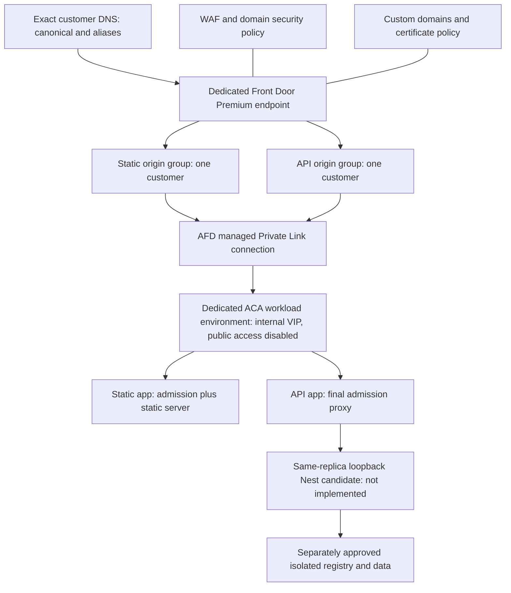

# F060.4A-2B-0 — Edge, TLS & Private Ingress IaC Readiness Assessment

Status: **Approved with required documentation hardening; hardening completed for final F060.4A-2B-0 acceptance review. Actual F060.4A-2B implementation remains unauthorized and blocked by the unresolved evidence/design requirements below.** Design/repository inspection only, dated 2026-10-09. The review authorizes one local documentation-only commit after checks, not provisioning, deployment, DNS, certificate, identity or secret operations.

## 1. Baseline, authority and scope

Authoritative local `main` and last-known `origin/main` were both `6c9f5df05b5c8bfbadf0771f867a35fe35026843`, clean with an empty index and 0 ahead / 0 behind. This merge includes reviewed serving commit `085be99bfcee6db953cf05512c29965dac98b849`. ADR-030 and F060.4A-2A serving configuration are present. No remote refresh was performed; local tracking state does not prove current remote state.

Created isolated branch `codex/edge-private-ingress-readiness` in `.local-uat/edge-private-ingress-readiness` at that exact HEAD. The only deliverable is this document. No ADR number is allocated. ADR-029, ADR-030, their index, application/operator code and Claude's PIM assessment/worktrees remain untouched.

Read the [protocol](../development/REQRO_CODEX_PROTOCOL.md), [context](../CITYVUE_CONTEXT.md), [architecture](../ARCHITECTURE.md), [roadmap](../ROADMAP.md), [security framework](../security/SECURITY_FRAMEWORK.md), [ADR index](../architecture/decisions/README.md), [ADR-030](../architecture/decisions/ADR-030-production-serving-contract.md), [ADR-025](../architecture/decisions/ADR-025-trusted-production-organization-resolution.md), [F016](F016-production-hosting-deployment-readiness-plan.md) and [F060.4A-2A](F060-4A-2A-production-serving-configuration.md). Historical checkpoint prose does not override verified Git state.

Evidence labels distinguish **Existing** inspected repository behavior; **Accepted** ADR-030 requirements; **Proposed** Azure design; **Unresolved** decisions/proofs; and **Future** work needing separate authorization. Repository capability and documentation are not deployed evidence.

## 2. Existing infrastructure conventions

Tracked-file inventory and content searches found no Bicep/Bicep parameters, ARM deployment templates, Terraform configuration, Pulumi project, GitHub Actions workflow or general Azure serving infrastructure pipeline. This is a repository finding, not an Azure subscription inventory.

| Existing artifact                                                                                                            | Capability and limit                                                                                                                                                                                          |
| ---------------------------------------------------------------------------------------------------------------------------- | ------------------------------------------------------------------------------------------------------------------------------------------------------------------------------------------------------------- |
| [Server Dockerfile](../../server/Dockerfile)                                                                                 | Multi-stage Node/Nest build, non-root runtime, port 3000. Not an admission proxy or static origin. Base image tag is not digest-pinned; future artifact provenance needs review.                              |
| [Compose](../../server/compose.yml), `server/deploy/local`, `deploy/database`                                                | Local PostgreSQL and role/bootstrap SQL conventions. No production edge/network graph; do not reuse development credentials or execute these scripts.                                                         |
| [Operator job template](../../server/azure-pipelines/templates/operator-job.yml) and request/approve/confirm pipelines       | Azure CLI creates/runs/deletes a one-shot ACI operator job. An Azure automation convention exists, but it is operator execution, not reusable serving provisioning. Its grants/PIM logic remain out of scope. |
| [Firebase Hosting](../../firebase.json), root package scripts                                                                | Static frontend deployment with global SPA rewrite. Not a private Azure origin; global fallback cannot be copied for API routing. Firebase remains untouched.                                                 |
| [Serving validator](../../server/src/config/serving-environment.ts), [React guard](../../react/src/config/servingConfig.mjs) | Production host/proxy/CORS and client/API configuration guards. These create neither a network boundary nor a single-Organization registry constraint.                                                        |
| [Host selection](../../server/src/tenancy/tenant-host-source.ts), [HTTP entry point](../../server/src/main.ts)               | Raw authority-field counting, immediate socket-peer checks and no forwarded-to-Host fallback. Entry point calls `app.listen(port)` without a bind address: loopback-only Nest is **not implemented**.         |

No tracked NGINX/Envoy configuration or production static-container definition was found. Nest middleware cannot replace an upstream origin admission boundary. Vite development serving and the operator container are not suitable production proxies.

## 3. IaC comparison and recommendation

**Proposed: Azure Bicep for the first Azure reference, subject to approval.** There is no established serving IaC framework to preserve. Future Azure modules should live in a clearly Azure-specific infrastructure directory while the serving contract and black-box tests remain provider-neutral. No template/directory/dependency is introduced now.

| Criterion          | Bicep                                                                                                | Terraform                                                                                                      |
| ------------------ | ---------------------------------------------------------------------------------------------------- | -------------------------------------------------------------------------------------------------------------- |
| Reviewability      | Typed resource/module declarations; review compiled graph and what-if.                               | HCL modules and plans; also review provider behavior/version.                                                  |
| Security           | Least-privilege Azure execution; no secret outputs/plaintext parameters; protect deployment history. | Same execution controls plus sensitive state/plan protection.                                                  |
| State management   | ARM holds state; no separate state backend. Still serialize deployments and detect drift.            | Explicit remote backend, locking, retention/recovery, access controls and separate customer/environment state. |
| Parameters/secrets | Typed configuration, secure parameters and secret references; no committed values.                   | Typed variables/references; `sensitive` alone does not remove values from state.                               |
| Repeatability      | Pin CLI/modules/API versions/images; review resource deletion semantics too.                         | Pin CLI/providers/modules/lockfile; review plan/apply/destruction and state ownership.                         |
| Tenant isolation   | One graph/scope and manifest per customer/environment; policy tests enforce boundaries.              | Separate state/scopes/credentials; workspaces alone are not security isolation.                                |
| CI/CD              | Offline compile/lint/graph tests; separately authorized Azure validation/what-if/apply.              | Offline fmt/validate with installed pinned providers; separately authorized plan/apply.                        |
| Azure coverage     | Direct resource API support reduces provider translation for AFD/ACA/Private Link.                   | Verify AzureRM field coverage; AzAPI is possible but another abstraction to review.                            |
| Portability        | Azure-specific modules; reusable provider-neutral contract.                                          | Multi-provider tool, but Azure resource graphs still require redesign elsewhere.                               |

State/API conclusions follow [Microsoft's Bicep overview](https://learn.microsoft.com/en-us/azure/azure-resource-manager/bicep/overview). HashiCorp's [sensitive-data guidance](https://developer.hashicorp.com/terraform/language/manage-sensitive-data) explains plan/state exposure and version/provider-dependent ephemeral/write-only support; never assume all resource secrets can be omitted. The [Azure backend](https://developer.hashicorp.com/terraform/language/backend/azurerm) supports locking and Entra/OIDC authentication, with separately owned storage/access prerequisites.

The recommendation reduces new state infrastructure for an explicitly Azure deployment; syntax does not confer security or cross-cloud portability. Reconsider if the infrastructure owner mandates an existing Terraform platform. Azure DevOps is a plausible separately gated serving pipeline because related conventions exist, but no control plane is selected or created here. Do not implicitly reuse operator identities/permissions.

## 4. Proposed resource graph

One customer/environment receives one isolated graph, not an entry in a shared customer edge/origin pool. Names, region, addresses, sizes and ownership remain unresolved inputs.

| Node         | Proposed resource/boundary                                                                                                                                                                                                    |
| ------------ | ----------------------------------------------------------------------------------------------------------------------------------------------------------------------------------------------------------------------------- |
| Scope        | Approved subscription, customer/environment resource group, tags/inventory. No automatic subscription/provider registration.                                                                                                  |
| Edge         | `Microsoft.Cdn/profiles` Premium; one `afdEndpoints` endpoint; exact `customDomains`; separate origin groups and routes below; default-domain route association disabled.                                                     |
| WAF          | `Microsoft.Network/frontDoorWebApplicationFirewallPolicies` plus profile security policy covering every approved domain/all paths. Reviewed managed rules, prevention mode, hostname/method rules and false-positive process. |
| Origins      | Separate static/API `Microsoft.App/containerApps`, images and FQDNs. One customer per origin group; no public backup or other-tenant failover.                                                                                |
| Environment  | Dedicated workload-profiles `Microsoft.App/managedEnvironments`, internal VIP, `publicNetworkAccess=Disabled`, VNet/delegated infrastructure subnet. Address sizing, private DNS, egress, zones and quota require review.     |
| Private Link | Origin settings target the exact environment resource/subresource/location. Explicit approval of matching private endpoint connections. Verify resource/request ownership, not just a request description.                    |
| Admission    | Static origin also validates external authority/provenance. API ingress targets only the final proxy port; no extra Nest TCP exposure. Origin Host/TLS name is the appropriate app FQDN, not a browser-selected tenant.       |
| Nest         | Candidate co-located proxy/Nest containers, fixed loopback upstream. Current broad listener blocks this claim; no bind-address environment option is assumed.                                                                 |
| Certificates | Prefer eligible AFD-managed domains; BYOC needs reviewed vault/reference and least-privilege certificate-read identity. None created here.                                                                                    |
| Monitoring   | Diagnostic settings to an approved destination; edge/WAF/proxy refusals, availability and certificate-expiry alerts. Reuse approved monitoring where permitted; no automatic APM/dashboard expansion.                         |
| Dependencies | Approved image registry/pull identity, isolated runtime database, DNS owner and secret delivery. No shared database, migration, grant or operator execution in this stack.                                                    |

Microsoft documents the internal-VIP/workload-profile private-access option in [the custom-VNet guide](https://learn.microsoft.com/en-us/azure/container-apps/front-door-custom-virtual-network-private-link). This proposal deliberately does not copy its use of the provider-default Front Door test hostname.

**Required implementation prerequisites for direct Front Door → Container Apps Private Link:**

- Azure Front Door **Premium**.
- An Azure Container Apps **workload profiles environment**.
- An **approved Front Door-created private endpoint connection** to the intended environment.
- Verification that the selected deployment region and Private Link region support the chosen topology.

These are prerequisites to verify before implementation/deployment planning can be accepted, not assumed repository capability or evidence that any resource exists. Repository configuration checks do not establish subscription availability, regional support or private endpoint approval.

AFD creates its private endpoint in a Microsoft-managed regional network. Origins with identical target resource/group/location can reuse a connection: separate origin groups do not imply separate endpoints. Use HTTPS 443 consistently. A customer-VNet endpoint is not AFD's endpoint; add one only for an explicitly approved operational need, with its own subnet/DNS/bypass review. [AFD Private Link documentation](https://learn.microsoft.com/en-us/azure/frontdoor/private-link) records region and differing-port limitations, lack of origin mTLS and lack of Static Web Apps support. These motivate private static containers and admission, not a production-readiness claim.

**Unresolved:** prove the selected internal-environment/app-ingress combination works via AFD. App ingress marked external is relative to the environment and may be needed for this private path; it does not authorize environment public access. Do not mechanically choose internal-only app ingress if that prevents Private Link delivery. Pin stable API versions after schema/capability review; documentation may display preview versions.

## 5. Explicit parameter contract

Every row is an explicit input or declared derived output validated by the next module. No real customer value is chosen. Resource identifiers are not credentials, but customer infrastructure metadata is not automatically public.

| Input                                                     | Classification               | Required handling                                                                                                                |
| --------------------------------------------------------- | ---------------------------- | -------------------------------------------------------------------------------------------------------------------------------- |
| Deployment identifier/environment stage                   | Public configuration         | Stable non-secret identifier; separate disposable/staging/production graphs; no default production scope.                        |
| Subscription, resource group, directory tenant IDs        | Sensitive configuration      | Explicit approved scope/execution identity; not inferred from CLI login. Directory tenant differs from Reqro Organization.       |
| Region/Private Link location                              | Public configuration         | Approved geography/cloud; check feature availability, zones and quota.                                                           |
| Canonical hostname/approved aliases                       | Public configuration         | Explicit canonical DNS names; no wildcard, IP, port, localhost, URL or provider-default serving name.                            |
| Static/API resource identity/name and origin groups       | Sensitive configuration      | Distinct IDs owned by the same customer/environment; names never establish tenant authority.                                     |
| ACA environment/VNet/subnet/private DNS references        | Sensitive configuration      | Dedicated boundary, approved address/egress design; reject arbitrary shared environment.                                         |
| Front Door profile/endpoint names, WAF policy             | Public configuration         | Explicit names/associations and Premium SKU.                                                                                     |
| Certificate mode/minimum TLS/rotation policy              | Public configuration         | Enumerated managed/BYOC; explicit secure floor, no insecure mode.                                                                |
| BYOC vault/certificate reference                          | Sensitive configuration      | Reference only; validate subscription, permissions and network compatibility.                                                    |
| Private key/PFX/password and runtime credentials          | Secret                       | Approved out-of-band secret management; never committed parameters, CLI literals, build args, frontend variables or outputs.     |
| Monitoring destination/retention/owners/alert contacts    | Sensitive configuration      | Approved location/access and minimal logging. Workspace keys, if used, are secrets.                                              |
| Customer deployment ID/expected Organization UUID         | Sensitive configuration      | Exactly one expected Organization; consistency assertion, not a browser selector, registry grant or new authorization mechanism. |
| Trusted final-hop addresses/CIDRs                         | Infrastructure-derived value | Measure actual immediate Nest peer; explicitly supply narrow runtime allowlist. Never substitute AFD public IPs or entire VNet.  |
| Origin FQDNs/environment ID/AFD profile ID/connection IDs | Infrastructure-derived value | Validate approved graph association; adapter configuration only. FDID is not a secret.                                           |
| Static/API/proxy image repositories and digests           | Public configuration         | Mandatory immutable digests/provenance, separate static/API artifacts; registry access separately protected.                     |
| Sizing/replicas/limits/health/rollout                     | Public configuration         | Approved bounds, budget and rollback digests; no chosen organization values.                                                     |
| Runtime database boundary/secret references               | Sensitive configuration      | Approved isolated dependency; no implicit DB provisioning/grants; actual credentials remain secret.                              |

Preflight compares host sets across edge, WAF, admission and `REQRO_PUBLIC_HOSTNAMES`; CORS is an approved HTTPS subset. Expected Organization consistency needs an approved read-only verification interface, not a made-up environment variable or registry mutation. Commit only synthetic example parameters; real configuration follows approved handling.

## 6. Exact routing

**Accepted:** customer hosts only, no wildcard serving/default host, unchanged `/api/v1`, no API-to-SPA fallthrough, missing assets return 404 and no cross-tenant fallback. A wildcard **path** is not wildcard host authorization.

**Proposed:** exact custom-domain associations on every route, `linkToDefaultDomain=Disabled`, `forwardingProtocol=HttpsOnly`, no prefix rewrite/`originPath`, and origin name checks enabled. These controls appear in the [AFD route schema](https://learn.microsoft.com/en-us/azure/templates/microsoft.cdn/profiles/afdendpoints/routes); their precedence/composition must be tested on the selected Premium API, not inferred from classic examples.

| Approved HTTPS request                                    | Edge destination                             | Origin behavior                                                                                                          |
| --------------------------------------------------------- | -------------------------------------------- | ------------------------------------------------------------------------------------------------------------------------ |
| `/api/v1`, `/api/v1/*`                                    | API group                                    | Preserve path/query to Nest; never cache or process as SPA.                                                              |
| `/api`, other `/api/*`                                    | API group guard route                        | Admission returns non-HTML 404; test `/api/v10` and `/api/v1evil`.                                                       |
| Other paths via `/*`                                      | Static group                                 | Serve actual files; GET/HEAD SPA fallback only for approved extensionless client routes. Missing file/assets return 404. |
| Unknown host, raw AFD hostname, unexpected authority/port | No customer route plus WAF/admission refusal | No tenant HTML/data; provider-generated denial is acceptable.                                                            |

Static origin independently rejects `/api` and `/api/*` even if edge routing drifts. `Accept: text/html` must not turn a missing asset into index HTML. Test case variants, encoded separators/dot segments, duplicate slashes and ambiguous encoding; refuse ambiguity rather than normalize into another authority or API/SPA interpretation.

Front Door owns domain/path/protocol association. Static origin owns file existence, fallback allowlist, methods and HTML headers. Admission owns origin Host/provenance/authority reconstruction. Nest retains versioned APIs, tenant verification and identity/authorization. Domain allowlisting does not activate a registry binding. Initially disable edge caching, with no-store HTML/runtime configuration/API/errors; immutable-asset optimization and CSP/HSTS implementation remain coordinated with separately approved 2C scope.

## 7. Authority/header contract

**Unresolved evidence requirement:** Microsoft documents that Front Door overwrites incoming `X-Forwarded-Host` with the original requested host. Do not infer that ACA ingress preserves that exact trusted authority through subsequent hops. Before production readiness, separately authorized disposable Azure validation must prove the complete **Front Door → ACA ingress → final admission proxy → Nest** chain, including received authority, multiplicity, reconstruction, immediate peer and refusal behavior at each observable boundary. A successful isolated Front Door check is insufficient.

External customer authority and origin Host are different validated values. Do not use an arbitrary public hostname as ACA's origin Host to preserve authority; the internal app FQDN must match routing/TLS.

| Hop              | Contract/evidence                                                                                                                                                                                                       |
| ---------------- | ----------------------------------------------------------------------------------------------------------------------------------------------------------------------------------------------------------------------- |
| Client → AFD     | Exact domain; reject missing/repeated/conflicting Host and HTTP/2 authority before choosing a name. Exact wire behavior is **unresolved**.                                                                              |
| AFD → ACA        | Microsoft documents overwrite of prior XFH with client Host and the FDID profile marker. This does not prove downstream preservation.                                                                                   |
| ACA → admission  | Exactly one external authority plus expected origin Host; capture actual header multiplicity/values/provenance. ACA docs do not promise XFH preservation. Stop if it is replaced with origin Host or ambiguity is lost. |
| Admission → Nest | Strip incoming `Forwarded`, XFH and other authority overrides, emit exactly one validated external XFH and fixed internal Host. Strip other forwarded metadata unless independently specified.                          |
| Nest             | Keep forwarded mode, actual immediate-peer CIDRs, raw duplicate/array/comma refusal, registry checks and Express trust proxy disabled.                                                                                  |

See [AFD headers](https://learn.microsoft.com/en-us/azure/frontdoor/front-door-http-headers-protocol). XFH is reserved from ordinary rule mutation, per [rule actions](https://learn.microsoft.com/en-us/azure/frontdoor/front-door-rules-engine-actions); do not invent an overwrite rule. [ACA ingress](https://learn.microsoft.com/en-us/azure/container-apps/ingress-overview) documents changes to other forwarded headers, leaving multi-hop XFH evidence outstanding.

A forged client XFH may be safely overwritten, so refusal of the forged **authority** need not reject the entire request. Prove that name never selects a tenant. At admission/Nest, ambiguous authoritative headers or untrusted peers must be refused. If an intermediary collapses duplicate Host fields irreversibly, the downstream proxy cannot reconstruct wire evidence; guessing is not a fix.

FDID equality is adapter-level consistency evidence, not cryptographic authentication. Combine it with proven network admission excluding unauthorized private clients/connections: a private caller can forge ordinary headers. No Azure header or identifier enters Reqro's core tenant model. Never fall back to origin Host, a browser Organization selector or a new arbitrary header.

## 8. Private origins and final admission proxy

**Required bypass proof:** public/direct access to both origins and direct access to Nest must be denied and verified by negative tests. Private Link connectivity or a healthy origin probe proves availability on the approved path only; neither proves that direct bypass is impossible. Test public origin FQDNs/addresses and unauthorized private paths with forged Host, XFH and profile-ID values, and verify that no tenant content is returned or protected application operation reached.

**Proposed candidate:** a minimal digest-pinned Envoy admission image beside Nest, with a small reviewed validation filter only if stock configuration cannot enforce the contract. This is not dependency/implementation approval. A local prototype must establish parser behavior before choosing a filter language. Stock NGINX/Envoy header variables do not automatically prove only one wire header existed.

Minimum responsibilities:

1. Validate expected origin Host, external deployment hostname and edge profile evidence before forwarding a body to Nest.
2. Reject ambiguous authority at the earliest observable point; rebuild exactly one XFH. Never choose the first/last chain entry.
3. Admit only the API subtree and return bounded non-HTML errors without reflecting raw headers/secrets.
4. Bound header/body sizes, request/idle/connect timeouts and concurrency. Approve values against existing attachment contracts; do not weaken attachment controls. No automatic mutation retries or public backend fallback.
5. Expose only the proxy port, disable/private-bind administration, use a fixed upstream, and avoid forward-proxy behavior. Logs exclude authorization, cookies, query tokens, bodies and personal data.
6. Provide minimal infrastructure health. Any probe exception needs verified provenance and exact path/method/Host; a probe header must never authorize ordinary application traffic. Tenant readiness stays separate.

**Critical blocker:** [main.ts](../../server/src/main.ts) lacks a loopback binding option. Omitting ACA extra ports does not prove process isolation. Preferred future remedy is separately reviewed listen-address configuration, explicit loopback upstream and only the proxy ingress listener bound outside loopback. This is an application/configuration change, not pure IaC, and is not authorized here. If that change is disallowed, obtain a different proven network/process boundary rather than silently retaining broad Nest exposure.

[ACA multiple-container documentation](https://learn.microsoft.com/en-us/azure/container-apps/containers) supports co-located containers sharing network resources. It does not establish this application's socket peer or that another workload cannot reach a process port. Measure IPv4/IPv6/mapped loopback behavior through scaling/revisions before populating trusted CIDRs; never substitute AFD service tags or the entire ACA subnet.

Private-origin acceptance requires environment public access disabled, no public alternate origin, only approved Private Link connections, no unapproved customer-VNet endpoint, controlled workload/deployment access and negative probes from the Internet, peer VNet, another app and another tenant. An internal caller able to forge FDID/XFH must not bypass admission. Network policy capability and ACA lateral access are blocking verification items. If ACA cannot meet them, return for architecture review, not weakened admission.

## 9. TLS lifecycle

**Proposed policy:** explicit minimum customer TLS 1.2, allowing 1.3 where supported; revalidate cipher/platform settings before implementation. Origins always use HTTPS and certificate-name/chain verification against their app FQDN. Private Link is not a substitute for TLS.

Prefer eligible Front Door-managed certificates on exact domains with direct CNAME and named DNS/certificate owners. BYOC is conditional on client requirements, approved vault reference/read identity, rotation and revocation/rollback procedures. [AFD TLS guidance](https://learn.microsoft.com/en-us/azure/frontdoor/end-to-end-tls) describes managed renewal dependence on direct CNAME and latest-versus-pinned BYOC version rotation. The [custom-certificate guide](https://learn.microsoft.com/en-us/azure/frontdoor/standard-premium/how-to-configure-https-custom-domain) records Key Vault subscription, chain and algorithm constraints; verify these for the chosen mode. No certificate is generated, requested, uploaded or configured here.

| Boundary/lifecycle  | Required future evidence                                                                                                                                                                                                                                                                                                                                        |
| ------------------- | --------------------------------------------------------------------------------------------------------------------------------------------------------------------------------------------------------------------------------------------------------------------------------------------------------------------------------------------------------------- |
| Issuance            | Named DNS owner approves TXT/CNAME or apex validation; valid certificate before serving routes activate. No assumed domain ownership.                                                                                                                                                                                                                           |
| Renewal             | Named certificate owner maintains validation/rotation and revocation response. Approve expiry thresholds/response SLA; external monitoring checks the actually served certificate, not just resource status.                                                                                                                                                    |
| Edge → origin       | Validate negotiated TLS, SNI and SAN/chain/name checks. Refuse mismatched, expired and untrusted certificates in disposable tests; no subject-check disabling workaround.                                                                                                                                                                                       |
| ACA ingress → proxy | ACA terminates TLS; this is not automatically TLS straight to the proxy. Assess supported peer-traffic encryption and its exact coverage; document/approve internal termination boundaries or redesign.                                                                                                                                                         |
| Proxy → Nest        | Candidate same-replica loopback; explicitly approve any local plaintext trust boundary. If policy requires TLS here, obtain a separate design/application change. No end-to-process encryption claim.                                                                                                                                                           |
| HTTP                | Proposed WAF denial of unsafe methods and all API HTTP before redirect. Only reviewed GET/HEAD static navigation may redirect to HTTPS on the same approved host. Prove ordering; never forward or redirect insecure mutations with 301/302 or 307/308. HTTPS-only refusal is the safe alternative. A redirect cannot protect a body already sent in plaintext. |

The [managed-environment schema](https://learn.microsoft.com/en-us/azure/templates/microsoft.app/managedenvironments) exposes peer traffic encryption/authentication controls; property existence does not prove coverage of every ingress leg. Resolve this against the stable API/topology before implementation. Monitor renewal, origin TLS, WAF and availability failures with sanitized diagnostics. HSTS preload/subdomain scope is not implicitly approved and remains a separate policy decision.

## 10. Deployment-per-tenant isolation

One manifest means one customer, one environment and one expected Organization/data boundary. Dedicated edge profile, static/API apps, environment and origin groups prevent shared customer pools. Multiple approved aliases may map to that same Organization; they do not authorize shared SaaS.

Future graph validation rejects foreign resource IDs, duplicate customer ownership, overlapping customer hosts, shared environments/origin groups across customers, mismatched image/config inputs and another customer's database/registry reference. Compare a fleet inventory as well as one template: tags alone do not enforce isolation. Separate execution scopes/credentials and deployment locks prevent concurrent cross-customer updates. No default customer, provider hostname serving or cross-tenant failover is generated.

Registry activation remains separately operator-governed. Verify all active allowed hostnames map to the expected Organization in its isolated data boundary, via an approved read-only verification interface. Fail on unexpected Organization/binding rather than select a default. Zero bindings may support infrastructure health but never tenant launch readiness. No database/schema/query change, migration, grant or PIM-evidence change is introduced here; no shared customer database is proposed.

## 11. Future test and rollout strategy

The following are proposed acceptance criteria, **not executed tests or passed Azure capabilities**.

### Mandatory default-domain and route assertions

Every production customer-serving route must explicitly set **`linkToDefaultDomain = Disabled`**. Only explicitly approved custom domains may be associated with those routes. The future static IaC test must fail if a customer-serving route enables the Front Door-generated default domain; also fail an omitted/ambiguous setting rather than rely on a service default. Negative fixtures must demonstrate this test rejects an enabled default-domain association.

Future route tests must prove all of the following, using emitted-graph assertions where applicable and local/disposable request evidence for runtime behavior:

1. Each customer-serving route has exactly the approved hostname associations, with no wildcard or provider-default association.
2. The exact `/api/v1` path reaches the API origin.
3. `/api/v1/*` descendants reach the API origin.
4. The API path, HTTP method, query and body are preserved through the full route to Nest; use synthetic payloads and compare received content without logging protected data. No rewrite, method conversion, body loss or mutation retry is permitted.
5. Approved non-API frontend routes reach the static origin.
6. Unknown `/api/*` paths never fall through to SPA `index.html`.
7. Missing static assets return an actual HTTP 404, not a successful index document.
8. Unapproved hostnames receive no tenant content, including when using the generated Front Door hostname.

Front Door domain/path matching is only one layer. Static-origin rejection of API paths, admission allowlists/header checks and application fail-closed tenant/authorization controls remain required. Tests must cover incorrect edge configuration without treating the edge as the application's security boundary.

| Stage                        | Required tests                                                                                                                                                                                                                                                                                                                                                                                         | Authorization boundary                                                                                                                          |
| ---------------------------- | ------------------------------------------------------------------------------------------------------------------------------------------------------------------------------------------------------------------------------------------------------------------------------------------------------------------------------------------------------------------------------------------------------ | ----------------------------------------------------------------------------------------------------------------------------------------------- |
| Offline static               | Pinned Bicep compile/lint and emitted-graph assertions; exact domains; disabled provider-default routes; no wildcard hosts, public origins or extra Nest ports; Premium/private links/TLS subject checks; HTTPS-only origin transport; unchanged API prefix/guard route; no mixed-tenant groups/fallback; image digests; secret scan; ownership; negative fixtures for every forbidden state.          | Future repository implementation approval. No Azure credentials; compile success is not deployability.                                          |
| Local container contract     | Raw HTTP/1.1 and HTTP/2 corpus; duplicate/comma/missing authority; origin Host/FDID mismatch; XFH reconstruction; API/SPA/assets; size/time/concurrency limits; proxy crash/Nest bypass; no mutation retries; sanitized logs.                                                                                                                                                                          | Future approved implementation, synthetic inputs. Regression scope follows actual code changes.                                                 |
| Azure validate/what-if       | Exact scope, resource ownership, API/quota/permissions and create/update/delete diff; private endpoint approval identities.                                                                                                                                                                                                                                                                            | Separate authenticated Azure assessment approval. What-if is not offline and does not authorize apply.                                          |
| Disposable Azure integration | Synthetic tenant/test domain; private connectivity; public/private/peer-app bypass; unapproved/default hosts; forged XFH/FDID, duplicate Host and conflicting HTTP/2 authority; path/query preservation; unknown API never HTML; asset 404; cert/SNI/chain failures; insecure method denial without Location; scale/revision peers; connection approval removal; origin outage fails closed; rollback. | Explicit budget/resources/DNS/credentials and cleanup approval; no production/customer data. Retain redacted request/response/network evidence. |
| Real-domain UAT              | Approved DNS/TLS/browser React/API flows, tenant activation readiness, staff identity behavior, WAF tuning, renewal/alerts and rollback rehearsal.                                                                                                                                                                                                                                                     | Separate client/domain approval after disposable evidence. Neither assessment nor template merge authorizes it.                                 |

[Bicep CLI documentation](https://learn.microsoft.com/en-us/azure/azure-resource-manager/bicep/bicep-cli) supplies compile/lint commands for the future static stage. No Bicep executable, provider or package is installed here.

Proposed order: approve design/inputs → implement offline templates and proxy/static artifacts → review graph/tests → authorize disposable resources → private origins created with public access already disabled → verify/approve exact AFD connections → prove TLS/authority/bypass → separately authorize customer DNS/activation/UAT. Do not open public origins as a bootstrap workaround. Health probes need no active tenant or tenant data.

Rollback retains approved template/image digests and reverts only the same customer graph. On private/TLS/authority failure, disable serving; never switch to public ingress, another tenant, Firebase or legacy persistence. DNS/certificate propagation and deletion are not atomic; retain valid bindings through transition, review what-if and authorize cleanup separately. Rehearse rollback and drift detection before production.

## 12. Decisions and blockers before actual 2B

| Decision/blocker                           | Required owner                      | Exit criterion                                                                                                                                     |
| ------------------------------------------ | ----------------------------------- | -------------------------------------------------------------------------------------------------------------------------------------------------- |
| IaC technology                             | Infrastructure architecture         | Approve Bicep or identify an existing mandated Terraform platform/state owner.                                                                     |
| Front Door Premium and total cost          | Product/budget                      | Current estimate for per-customer Premium/WAF/traffic, Private Link, ACA replicas, logs/egress, registry and optional vault. No prices assumed.    |
| Subscription/resource group/region         | Infrastructure/security             | Named scope, region/data residency, registration/quota and deployment permissions.                                                                 |
| DNS/certificates                           | Domain/security                     | Approve canonical/aliases, managed/BYOC choice, apex/indirect-CNAME handling, issuance/renewal/expiry and incident ownership.                      |
| WAF/monitoring/incident response/retention | Security/operations/product         | Named owners, false-positive process, sanitized fields, alert response and retention. Do not inherit operator audit retention for web access logs. |
| ACA sizing/environment strategy            | Infrastructure/product              | Dedicated customer/environment, subnet/egress policy, sizes/min/max replicas, availability target and supported Private Link topology.             |
| Header integrity/admission                 | Application/security/infrastructure | Prove AFD→ACA→proxy XFH, ambiguous wire rejection, proxy/parser selection and provenance model.                                                    |
| Nest listener isolation                    | Application/security                | Approve narrow bind-address change or proven alternative; measure peer and direct Nest denial.                                                     |
| Private lateral access/TLS coverage        | Infrastructure/security             | Prove private clients cannot bypass; document encryption/approved termination boundaries for every hop.                                            |
| Pipeline/environment promotion             | Release/security                    | Serving-specific identity/approvals/locks, artifact promotion and rollback/deletion authority; no operator/PIM scope expansion.                    |
| Isolated registry/data prerequisite        | Data/application/operator           | Expected Organization/bindings verified through an agreed read-only interface, without new grants/migrations.                                      |
| Disposable tests/real-domain UAT           | Budget/domain/product               | Separate execution and cleanup authorizations.                                                                                                     |

**Readiness decision:** the Azure reference is plausible and Bicep is a justified recommendation, but actual F060.4A-2B implementation waits for review of this resource/parameter contract and resolution of design blockers. An IaC-only change cannot promise loopback-only Nest today, and documentation cannot certify the complete forwarded-authority chain. A separately authorized local prototype can resolve design choices before any cloud experiment. No invariant is weakened to declare readiness.

## 13. Assessment validation and handoff

Only this document is added. Applicable checks are explicit unignored Prettier formatting, relative Markdown link existence, `git diff --check`, whitespace inspection including this untracked file, unchanged tracked/protected files, unchanged baseline HEAD and empty index. Application suites, cloud/IaC validation, disposable integration and real-domain UAT are not executed for a documentation-only assessment. The accepted React baseline exception is unaffected.

Initial assessment checkpoint (before review hardening): Prettier check passed; all 19 relative links resolve; `git diff --check` passed; the new file has no trailing whitespace. The supplemental no-index comparison against `NUL` reported the expected added-file difference (exit 1), with no whitespace diagnostics. There are zero tracked modifications, one untracked assessment file and an empty index. HEAD remains the baseline, 0 ahead / 0 behind the local tracking reference; authoritative main remains clean. No application test result is inferred from these documentation checks.

At that initial checkpoint, no commit, push, deployment, provisioning, DNS/certificate operation, Azure CLI/authentication, secret creation or operator/PIM modification occurred. Public Microsoft/HashiCorp documentation was researched; these sources are architectural inputs, not deployed proof.

### Required documentation hardening and local commit gate

The review approved F060.4A-2B-0 with the five documentation requirements now made explicit: direct ACA Private Link prerequisites; disabled default-domain route association and a failing static test; the eight route acceptance assertions including method/query/body preservation; unresolved authority evidence across the complete AFD/ACA/proxy/Nest chain; and negative public/direct-origin bypass proof independent of connectivity/health.

The recommendation remains Azure Bicep. Existing listener-isolation, header-integrity, private-lateral-access, TLS-coverage and infrastructure ownership/cost blockers remain open. No IaC or application implementation is included. Only this document may be staged for the authorized local commit, `docs(infra): assess private ingress IaC readiness`, after formatting, relative-link, whitespace and exact-file-scope checks pass. The final commit SHA and post-commit Git status are reported separately to avoid embedding a commit's own hash. No push, deployment or provisioning is authorized; F060.4A-2B implementation does not begin.

**STOP FOR FINAL F060.4A-2B-0 READINESS ACCEPTANCE REVIEW.**
