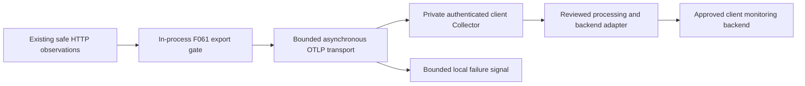

# F061.2C-0 — Telemetry Export and Monitoring Backend Readiness

**DESIGN / REPOSITORY ASSESSMENT ONLY — PROPOSED, NOT AN ACCEPTED ARCHITECTURE DECISION.**

**NO TELEMETRY EXPORTER, DESTINATION, CREDENTIAL, COLLECTOR OR CLOUD RESOURCE IS CONFIGURED BY THIS SLICE.**

Recommend **Option D: provider-neutral OTLP from Reqro to an isolated Collector, with backend-specific authentication and mapping outside the application**. Prefer a separate private Collector service per client deployment for production; a sidecar is a conditional alternative. Azure Monitor/Application Insights is a candidate deployment backend, never the core telemetry model.

**Readiness verdict:** production export is **NOT safe to activate**. Architecture review approved the direction with required documentation hardening; final assessment acceptance and separate implementation authorization remain outstanding. The next implementation slice may be a **no-network exporter/privacy abstraction only**. Network-capable OTLP export, including a synthetic local harness, remains gated on writer identity, Collector authentication/TLS, numerical queue/retry/lifecycle limits, backend compatibility and operational ownership. This slice authorizes one local documentation-only commit; no runtime change, dependency installation, environment-variable addition, Collector YAML, push or deployment.

Review navigation: [recommendation](#2-options-and-recommendation), [privacy gate](#8-in-process-privacy-gate-before-export), [implementation slices](#17-recommended-slices-and-gates), [blockers](#18-blockers-and-review-decisions).

## 1. Baseline and evidence

Assessment date: 2026-10-10. Fetched authoritative origin/main and verified main, origin/main and FETCH_HEAD at **5552ec61562a25399df8c507ca8e14928e5cc1b0**. Created branch **codex/f061-2c-0-export-readiness** in **.local-uat/f061-2c-0-export-readiness**, initially clean with empty index, 0 ahead / 0 behind. The fetch completed with the existing stale-worktree cleanup permission warning; no other worktree was repaired. Remote-tracking state is the last fetched observation, not proof of later remote changes.

Read-only inspection identified Claude's **claude/f062-2d-0-worker-readiness** worktree at the same baseline, initially clean. This allocation is only this assessment document. No F062, integration, outbox/connector persistence, worker/grant, database, migration, ADR/index, source, package or deployment file is allocated here.

Repository authority: [execution protocol](../development/REQRO_CODEX_PROTOCOL.md), [architecture](../ARCHITECTURE.md), [roadmap](../ROADMAP.md), [security framework](../security/SECURITY_FRAMEWORK.md), [client-neutral isolated development](../decisions/ADR-003-client-neutral-platform-isolated-development.md), [Organization isolation](../architecture/decisions/ADR-001-organization-isolation.md) and [production serving contract](../architecture/decisions/ADR-030-production-serving-contract.md). Historical feature statements retain their checkpoint meaning; this assessment needs no correction to another document.

| Inspected evidence                                                                                                                                   | Current implemented state                                                                                       | Export gap                                                                                                |
| ---------------------------------------------------------------------------------------------------------------------------------------------------- | --------------------------------------------------------------------------------------------------------------- | --------------------------------------------------------------------------------------------------------- |
| [F061.1 contracts](../../server/src/observability/telemetry-contracts.ts) and [metric policy](../../server/src/observability/metric-label-policy.ts) | Finite label vocabularies; at most four labels and 256 combinations; restricted attributes forbidden in metrics | Not a general serialized-span/resource export validator                                                   |
| [F061.1A consumer-edge test](../../server/test/unit/telemetry-contracts.test.ts)                                                                     | Exact reviewed import edges, including integration policy consumer and tracing/metrics adapters                 | New consumers need exact review, never directory allowlists                                               |
| [F061.2A runtime](../../server/src/observability/request-tracing.ts) and [middleware](../../server/src/observability/request-tracing.middleware.ts)  | Default-disabled, server-root spans created at completion; fixed resource; no propagation or events/links       | Factory defaults to zero processors/exporters; no active in-flight parent                                 |
| [F061.2B runtime](../../server/src/observability/request-metrics.ts) and [record](F061-2B-safe-http-request-metrics-foundation.md)                   | Default-disabled counter and explicit-bucket duration histogram; validated labels                               | Factory defaults to zero readers/exporters; no retained operational series                                |
| [Configuration](../../server/src/config/configuration.ts) and [environment validation](../../server/src/config/environment.ts)                       | Existing tracing/metrics flags; service-name and OTLP-endpoint placeholders                                     | Endpoint has generic URI validation and is unused by these adapters; not an approved destination contract |
| [Pino sanitization](../../server/src/common/logging/log-sanitization.ts) and [health service](../../server/src/health/health.service.ts)             | Logs remain Pino-owned; liveness is local metadata, readiness checks database                                   | No telemetry-health endpoint or approved fallback-export diagnostic vocabulary                            |

Both runtime modules use private factories without production processor/reader injection. Resources are exactly service.name=cityvue-api. Source and lockfile inspection found no OTLP/Azure/Application Insights exporter dependency or network-export wiring. Test-only in-memory collection is not a configured operational exporter.

### Package versions

| Package                                         | Locked version | Installed version observed |
| ----------------------------------------------- | -------------- | -------------------------- |
| @opentelemetry/api                              | 1.9.1          | 1.9.1                      |
| @opentelemetry/resources                        | 2.12.0         | 2.12.0                     |
| @opentelemetry/sdk-trace                        | 2.12.0         | 2.12.0                     |
| @opentelemetry/sdk-metrics                      | 2.12.0         | 2.12.0                     |
| @opentelemetry/core, transitive                 | 2.12.0         | 2.12.0                     |
| @opentelemetry/semantic-conventions, transitive | 1.43.0         | 1.43.0                     |

Locked versions come from this baseline's [server lockfile](../../server/package-lock.json). Installed versions were read from the existing F061.2B worktree's package manifests, not inferred from ranges. This assessment worktree has no node_modules; no install occurred. sdk-metrics requires API >=1.9.0 and <1.10.0; the observed API satisfies it. Future exporter packages must be checked against this exact family rather than assuming all OTel packages share one version number.

## 2. Options and recommendation

A and D both use OTLP, and B describes placement; the options overlap. Here A means application-to-remote destination without a Reqro-operated intermediary, B a local agent/sidecar, C a backend-specific exporter inside Reqro, and D a deployment-owned mediation boundary.

| Criterion              | A — direct OTLP                                      | B — local/sidecar Collector                         | C — backend-specific app exporter              | D — OTLP plus external adaptation                                 |
| ---------------------- | ---------------------------------------------------- | --------------------------------------------------- | ---------------------------------------------- | ----------------------------------------------------------------- |
| Provider neutrality    | Neutral wire; backend constraints still reach config | Neutral first hop, external backend choice          | In-process SDK/config coupling                 | Application and backend separated                                 |
| Failure isolation      | App exporter contains remote outage                  | Buffering helps; shared host/lifecycle can hurt API | Vendor SDK retries run in API                  | Separate collector/backend resource boundary                      |
| Operational complexity | Few components; replicas own remote transport        | Collector per replica, multiplied upgrades/budgets  | Initially simple; vendor behavior needs review | Separate service, identity, capacity and upgrades                 |
| Secrets                | Remote write credentials may reach each replica      | Backend credentials can stay in sidecar             | Backend identity/credentials in Reqro          | Backend credentials only in Collector; app has ingress reference  |
| Network dependencies   | App reaches backend and identity endpoints           | App local; collector remote                         | App reaches vendor DNS/auth/transport          | App only reaches approved receiver; collector owns backend egress |
| Buffering              | Small bounded SDK memory                             | Adds bounded collector memory                       | Audit vendor defaults and offline storage      | Small app queue and separate collector queues                     |
| Retries                | Bounded inside app exporter                          | Split local and backend budgets                     | Vendor defaults may conflict                   | One responsible retry layer per hop                               |
| Portability            | Good if backend accepts exact semantics              | Good where collector hosting exists                 | Lower; migration affects app release           | Same app boundary for Azure/non-Azure                             |
| Tenant isolation       | Distinct endpoint/identity per deployment            | Separate sidecar/destination per client             | Backend isolation still required               | Separate receiver, queue, destination and access scope            |
| Cost                   | Least collector compute; backend costs remain        | Compute duplicated with API scale                   | No collector compute; vendor costs/coupling    | Collector baseline cost; budgets centralized within each client   |

**Choose D with a separate private Collector service inside each client deployment's approved region/network boundary.** Backend identity, retries and mapping can change independently of Reqro. A telemetry sidecar's startup must not become a condition of API availability. Operations accepts the additional service and patching duty; no infrastructure is approved here.

A sidecar is conditional on proof of independent API readiness, resource quotas and bounded shutdown during collector failure. Shared host pressure and lifecycle mean it is not complete failure isolation. A collector outage may lose telemetry but must not block ingress, request completion, scaling or database readiness. Do not infer a global all-client collector.

The upstream [gateway pattern](https://opentelemetry.io/docs/collector/deploy/gateway/) supports standalone collectors and highlights routing/affinity concerns for stateful processing. Per-client placement is this assessment's recommendation, not an upstream requirement.

### Proposed signal path

This is a future trust boundary, not implemented wiring. Pino logs and authoritative audit remain separate.

## 3. Azure as a deployment backend

### Current external evidence

Microsoft's [OTLP ingestion overview](https://learn.microsoft.com/en-us/azure/azure-monitor/containers/opentelemetry-summary) documents native OTLP ingestion in preview-oriented Azure Monitor ingestion experiences. Its [collection and analysis guidance](https://learn.microsoft.com/en-us/azure/azure-monitor/containers/collect-use-observability-data) describes preview limitations and delta temporality with exponential histogram aggregation for some Application Insights OTLP experiences. These observations are dated to this assessment, not a guarantee for a future deployment. Azure Monitor remains an **optional reference backend**. Its support status must be reverified for the target production deployment, and explicit client, security and operations approval is required before native OTLP ingestion becomes a production dependency. Reqro must remain provider-neutral; this assessment does not certify an Azure production route.

The [Collector ingestion guide](https://learn.microsoft.com/en-us/azure/azure-monitor/containers/opentelemetry-protocol-ingestion) describes Entra-authenticated ingestion, Log Analytics for logs/traces, Azure Monitor workspace for metrics, and DCR/DCE routing. It distinguishes community support for Collector components from Azure service support. Exact endpoints, regions, network integration, identity permissions and pinned-version compatibility require later verification; do not copy example endpoints.

The alternative [contrib Azure Monitor exporter](https://github.com/open-telemetry/opentelemetry-collector-contrib/blob/main/exporter/azuremonitorexporter/README.md) is currently beta for traces, metrics and logs; its documented metrics destination is Application Insights customMetrics. That is a different path from native OTLP. It needs independent mapping, histogram, authentication, retry and support tests. Neither package existence nor a connection string proves readiness. No silent fallback between paths is acceptable.

Sources were consulted on the assessment date. Reverify changing product status before selection. No Azure account or tenant was inspected.

### Responsibility allocation

| Location                   | Proposed responsibility                                                                                                        | Excluded                                                                                  |
| -------------------------- | ------------------------------------------------------------------------------------------------------------------------------ | ----------------------------------------------------------------------------------------- |
| Reqro                      | F061 validation, private providers, neutral names, bounded OTLP and local failure state                                        | Azure types/credentials, resource detectors, vendor distro auto-instrumentation           |
| Collector/adapter          | Authenticated receiver, limits, reviewed mapping/temporality, backend credentials and retries                                  | Tenant lookup, host/user enrichment, raw URL/IP creation for dashboards, forbidden labels |
| Azure infrastructure       | Approved identity/RBAC, supported private connectivity, ingestion resources, region, storage/access/retention, backend budgets | Treating telemetry identity as Reqro user authority; tenant isolation by labels           |
| Operations/security/client | Backend/preview acceptance, support, cost/retention/residency, tests and release approval                                      | Treating assessment as provisioning or client authorization                               |

Keep Reqro names/units/meaning authoritative. Any backend alias belongs to a documented external mapping. Vendor dashboards must not redefine a refusal as an SLO-eligible success; missing fields remain missing instead of being inferred from request content.

## 4. Failure isolation and bounded lifecycle

**Business request success/failure must not depend on telemetry backend availability.** Prove this under outage and load; try/catch alone cannot contain CPU, heap or timer pressure.

| Condition                              | Required future behavior                                                                                                                          |
| -------------------------------------- | ------------------------------------------------------------------------------------------------------------------------------------------------- |
| Disabled                               | No exporter, DNS, token lookup, socket, timer or export queue; zero network                                                                       |
| Invalid export-only config             | Refuse exporter activation, emit bounded local diagnostic, preserve API startup; deployment preflight separately refuses observability acceptance |
| Initialization/auth failure            | No-op/degraded; no awaited remote handshake on startup; finite recovery rate/deadline                                                             |
| Unreachable, slow or throttled backend | Background-only export, cancellation/queue/retry/concurrency bounds, drop at limit; no business retry/exception                                   |
| TLS/identity/endpoint refusal          | Stop export; no insecure downgrade, fallback destination or ambient credential fallback                                                           |
| Full queue/memory pressure             | Reject telemetry admission for that signal, record bounded loss and preserve business work                                                        |
| Partial acceptance                     | Count bounded rejection, never log response text or replay a partially accepted batch wholesale                                                   |
| SDK/collector crash                    | API continues; telemetry gap is not fabricated success                                                                                            |
| Shutdown                               | One bounded drain/flush window, cancel remaining work, drop remainder, allow API shutdown                                                         |

The [OTLP specification](https://opentelemetry.io/docs/specs/otlp/) distinguishes retryable errors from partial success, for which the request must not be retried. A first-hop acknowledgement is not proof of durable backend storage. No exactly-once or lossless claim is made.

### Budget contract for implementation review

Production activation needs an explicit reviewed budget vector. Every limit must be finite; unset/zero must never mean unlimited. These are required relationships and acceptance gates, not fabricated production sizes.

- T_attempt covers DNS, connection, TLS, auth wait, response and SDK-internal retries. Cancellation releases handles; a Promise timeout alone is insufficient.
- Batches have record-count and encoded-byte caps. Queues have count, byte-estimate and age caps. Individual records and decompressed responses have size limits. Refuse oversize content before queue growth.
- Start the synthetic prototype with at most one in-flight export per signal. Higher concurrency needs measured memory/outage evidence; no unbounded promise fan-out or overlapping collections.
- No app-owned outer retry loop. Any built-in transport retry fits T_attempt. Collector/backend retries use capped backoff with jitter and finite attempts/elapsed age; Retry-After cannot extend this indefinitely.
- T_flush is one shared process budget, not a new allowance per signal/batch. It must fit within remaining platform termination grace after business draining. No new retry horizon at shutdown.
- T_collection exceeds worst-case collection/export occupancy or causes a skipped, diagnosed collection rather than overlap. Export cadence is separate from request-duration measurement.
- Collector queue capacity, retry age, accepted payload size, concurrency and memory soft/hard limits are separately approved. Identity renewal and DNS retry need bounds too.
- Queue memory, in-flight batches, SDK aggregation, serialization/compression and TLS/auth buffers must fit a measured telemetry allocation with headroom. Serialized-byte limits alone do not bound JavaScript heap.

Numerical production limits are a **blocker**, owned by operations/platform after synthetic fault/load measurement. Clearly finite test-only values may be proposed later; SDK defaults cannot silently become production policy.

## 5. Buffering, backpressure and loss

| Mechanism                    | Assessment                                                                                                                     |
| ---------------------------- | ------------------------------------------------------------------------------------------------------------------------------ |
| In-process batching          | Small volatile first-hop memory buffer; drop-on-full; no synchronous network/disk in request handling                          |
| Collector memory queue       | Recommended initial retry buffer, separately bounded per signal; outages eventually lose data                                  |
| Collector disk queue         | Defer until justified by loss tolerance; needs quota, encryption, permissions, deletion/age policy, disk-full and replay tests |
| Backend-native buffering     | Protects only after acceptance, not earlier transport gaps                                                                     |
| Application persistent queue | Rejected: new storage/privacy obligations; never reuse F062 outbox, transactions or grants                                     |
| Durable external broker      | Not justified initially; separate operational case required                                                                    |

[Collector resiliency guidance](https://opentelemetry.io/docs/collector/resiliency/) documents loss at queue/retry limits and optional file-storage queues. Persistence reduces some restart loss, not overflow or storage failure.

Distinguish sampling, policy rejection, queue drops, export rejection and missing collection. Cumulative values can bridge missed exports only while originating state survives; they cannot recover observations never recorded. Delta replay may duplicate accepted intervals. Use timestamp/reset/gap semantics, not an application queue of arbitrary old metric snapshots.

## 6. Sampling framework

No final percentage is selected. Metrics stay unsampled; trace decisions never change counters or authoritative audit.

F061.2A creates one root span **at response completion**, with trusted outcome known. A later reviewed admission policy can preferentially retain failed observations and probabilistically admit successes without active distributed context. This is completion-time selection, not a claim that generic head sampling knows future errors.

| Case                                   | Proposed policy                                                                                                                       |
| -------------------------------------- | ------------------------------------------------------------------------------------------------------------------------------------- |
| Failed outcome: 5xx, abort/no-response | Nominally always eligible, with reserved bounded error capacity; overload still drops visibly, so no promise of retaining every error |
| Successful completion                  | Deterministic probability using server-owned decision input; final rate from volume/cost/diagnostic evidence                          |
| 4xx/refusal                            | Separate policy; attacker-generated failures must not exhaust error capacity                                                          |
| Endpoint-specific                      | Only trusted finite templates; unmatched is one category, never raw URL/identity/query                                                |
| Health                                 | Preserve existing exact exclusions; do not inspect raw URLs to reclassify early unmatched requests                                    |
| Future multi-span traces               | Reassess consistency, error completeness and tail-sampling state/cost                                                                 |

[OTel sampling guidance](https://opentelemetry.io/docs/concepts/sampling/) explains that ordinary head sampling cannot ensure all error traces are captured, while tail sampling evaluates completed trace information. A collector cannot recover spans dropped upstream. Tail sampling needs bounded active-trace memory, decision windows, late-span policy and trace-affine routing; defer it while only completion-time roots exist.

Operations owns rates/capacity; security/privacy approves data and abuse behavior; service owners approve diagnostic sufficiency, with client approval where applicable. Policies are version-controlled deployment config. No inbound sampled bit or resident/staff/tenant identity selects a policy. No SLO denominators derived from sampled traces or invented inverse-probability counts.

## 7. Metrics semantics and replica safety

Preserve these exact instrument contracts:

| Instrument                         | Meaning                                                                                         |
| ---------------------------------- | ----------------------------------------------------------------------------------------------- |
| reqro.http.server.requests         | Monotonic counter, unit {request}, one observed completion/abort                                |
| reqro.http.server.request.duration | Histogram in ms; boundaries 5, 10, 25, 50, 100, 250, 500, 1000, 2500, 5000, 10000 plus overflow |
| Shared labels                      | Exactly method, routeTemplate and statusClass, validated by F061.1                              |
| Series budget                      | 8 × 5 × 6 = 240 possible label sets per instrument; health enum values are not emitted          |

This is not the total backend series budget: bucket expansion, resources, replicas, environments and retention add cost. No outcome or release label may be appended without policy review. F061 names remain authoritative even if a backend needs documented external aliases.

Recommend **cumulative sums and cumulative explicit-bucket histograms for the first neutral local interoperability contract**, matching the test reader and preserving buckets. Select eventual export cadence from resolution, cost and collection-overhead evidence. SDK collection intervals are not SLO windows. Preserve timestamps, monotonicity, units, bucket bounds and resets; do not sum repeated cumulative snapshots or average per-replica percentiles.

The [OTLP metric-exporter contract](https://opentelemetry.io/docs/specs/otel/metrics/sdk_exporters/otlp/) supports configurable temporality and aggregation. Delta may be a later explicit, tested profile. A collector cumulative-to-delta stage requires per-stream continuity and restart policy; the [processor documentation](https://github.com/open-telemetry/opentelemetry-collector-contrib/blob/main/processor/cumulativetodeltaprocessor/README.md) identifies statefulness. Arbitrary round-robin routing is not safe for that conversion.

### Hard writer-identity and backend-readiness gates

1. **Writer identity is a hard implementation gate for network-capable OTLP export.** Resources currently contain only service.name=cityvue-api. The [OTel single-writer model](https://opentelemetry.io/docs/specs/otel/metrics/data-model/#single-writer) requires unambiguous stream ownership. Future multi-replica deployments must prove each OTLP metric stream has an unambiguous writer/resource identity and cannot conflict when Collector gateways are replicated. Evidence must cover concurrent app replicas, rolling overlap, restarts, gateway routing, failover and stateful conversion or aggregation. Review a privacy-approved deployment/service/instance resource identity scheme or proven Collector partition/aggregation using authenticated source identity. These operational resource identities are separate from Reqro business metric labels: **do not add replica IDs as ordinary application metric labels**. Resources are not a loophole for prohibited data; no service.instance.id, pod ID, hostname or arbitrary UUID is newly approved here. A one-writer local experiment does not satisfy the multi-replica gate.
2. **Azure histogram/temporality compatibility is a hard backend-readiness gate.** Some documented Application Insights OTLP experiences expect delta temporality and exponential histogram aggregation; F061.2B records a cumulative explicit-bucket request-duration histogram in the proposed local profile. Compatibility-test the existing histogram against the exact target Azure Monitor/Application Insights ingestion path before claiming readiness. Verify temporality, aggregation, units, boundaries, count/sum integrity, reset/loss behavior and backend interpretation. Temporality conversion alone does not convert histogram shape, and bucket totals cannot reconstruct original observations for exact arbitrary re-bucketing. A supported loss-accounted external mapping, a separately authorized aggregation change, or an alternative compatible backend requires explicit evidence. Do not modify F061.2B in this assessment, silently replace buckets or claim built-in dashboards work. This is a blocker for the proposed route, not a claim that every Azure custom-metric route is impossible.

## 8. In-process privacy gate before export

F061.1 remains the sole attribute/cardinality authority. Its validator covers metric labels, not SDK resources, scope metadata, all span fields or exporter envelopes. A future gate implements the existing policy for those surfaces and obtains approval for new fields, rather than creating a competing permissive policy.

Proposed order: **trusted projection → schema/value/size validation → sampling/aggregation → bounded safe snapshot → envelope revalidation → serialization/transport**. Only safe records enter export queues. Rejection fails closed for telemetry while preserving business processing. Exporters never receive Request, Response, Error, user, tenant or vendor objects.

| Surface                | Initial future admission rule                                                                                                                                                                                |
| ---------------------- | ------------------------------------------------------------------------------------------------------------------------------------------------------------------------------------------------------------ |
| Metric points          | Only existing names/types/units and exactly three existing labels; every label set through validateMetricLabels; valid numbers, timestamps, bucket counts/bounds and budget                                  |
| Trace attributes       | Only http.request.method, http.route, http.response.status_code, reqro.outcome and reqro.reason under existing F061.2A value rules; no arbitrary status description                                          |
| Trace IDs              | Server-generated trace/span IDs may be trace protocol fields; never metric labels or authority                                                                                                               |
| Reqro correlation UUID | Preserve current local behavior; recommend omitting reqro.correlation_id from initial external export until external lookup/access/retention purpose is approved; never alter response/log/audit correlation |
| Resource/scope         | Fixed service.name=cityvue-api and known Reqro scope names only; reject arbitrary detector/environment fields, scope version/schema URLs and resource additions pending review                               |
| Other span content     | Bounded trusted name, kind, timestamps and status; no events, links, exceptions, baggage, raw tracestate or unexpected parent                                                                                |
| Diagnostics            | Closed reason/count/state only; no endpoint, credential, rejected key/value, response body or raw exception                                                                                                  |

Validate values as well as keys: a concrete URL under route or a customer hostname in a scope name is refused. Validate the chosen SDK's entire envelope and test the serialized bytes. SDK limits may truncate unsafe data without sanitizing it. Use detached snapshots and revalidation so later processors cannot mutate approved fields before transport.

PII, contacts/Notes/answers/attachments, bodies, raw URL/path/query, headers, authorization/cookie, SQL, errors/stacks, vendor payloads/status, Organization/customer/tenant hostnames or IDs, resident/request/connector/intent/aggregate/resource/external-record IDs and operator/Entra identity remain blocked. F061.1's possibility of later trace/log review is not permission to export restricted fields now.

Collector/backend rejection is defense in depth, not the first privacy layer. No host/process/cloud/Kubernetes detector, geolocation, DNS enrichment, database lookup, span-to-metrics connector or attribute-based tenant router is approved. Transport connection logs and backend operational metadata need separate privacy/access/residency review; an attribute gate cannot make network addresses disappear from receiving infrastructure.

## 9. Trace context and later outbound propagation

Preserve ROOT_CONTEXT, server-owned trace roots, existing correlation ownership and refusal to extract inbound traceparent, tracestate or baggage. Export enablement must not register inbound propagation or auto-instrumentation.

Later outbound propagation needs a separately reviewed in-flight lifecycle: today's span does not exist during the handler, so adding headers is not a trivial exporter change. Review approved dependencies, parent/child lifetime, cancellation, fan-out/retries, redirects, trace-ID disclosure and remote trust. Only server-generated trace context could be injected, never tenant/authorization/resident data or copied baggage. Strip context on unapproved redirects and never propagate to user-supplied URLs. Exporting a trace does not authorize sending context to a dependency. No F062 worker/integration propagation design is allocated here.

## 10. Destination and credential trust

Only a deployment-controlled, validated profile may activate export. It binds signal, protocol, exact host/port/path, trust roots, authentication and authorized receiver. Endpoints are sensitive infrastructure config, never request data.

- Require HTTPS and chain/hostname/SAN validation for production HTTP; equivalent verified TLS for any future gRPC profile. No disabled verification, expired/self-signed bypass or plaintext fallback.
- Enforce exact destination allowlists in config and network egress. Limit DNS and identity-service access separately. Prevent DNS rebinding into unintended targets through approved DNS/network policy.
- Disallow URL userinfo, fragments, arbitrary query overrides, redirects and runtime URL/header overrides. Reject conflicting SDK environment overrides or prove they cannot override the validated profile. No default/public endpoint fallback.
- Endpoint pinning means approved destinations and CA policy, not unmanaged leaf-certificate pins that break renewal. Any required certificate pins need rollover/revocation ownership.
- Authenticate collector ingress beyond private-network location. Prefer workload identity with a supported reviewed verifier; mTLS is an alternative with issuance/rotation/revocation ownership. Do not assume an ordinary OTLP receiver validates Entra bearer tokens automatically.
- Bind authenticated senders to preconfigured client pipelines. Host, baggage, telemetry labels and request headers cannot select destinations or credentials.
- Backend identity stays in the collector/adapter. Least-privilege export identity and human query/admin identities remain separate.
- Auth lookup/renewal fits export deadlines. No interactive login, fallback to developer credentials or automatic privilege expansion.

| Pattern                   | Assessment                                                                                                                                |
| ------------------------- | ----------------------------------------------------------------------------------------------------------------------------------------- |
| Managed identity          | Preferred for Azure-hosted collector-to-Azure ingestion where exact service/adapter support is proven; grants need separate authorization |
| Workload identity         | Preferred for approved federated non-Azure/CI workloads; review issuer/audience/subject binding, token file and lifetime                  |
| API key/connection string | Last resort; approved secret reference, rotation/revocation; no repo/browser/log exposure or embedded endpoint bypass                     |
| mTLS                      | Suitable with receiver/backend support and owned certificate lifecycle; private keys stay secret references                               |

[Azure Entra authentication guidance](https://learn.microsoft.com/en-us/azure/azure-monitor/app/azure-ad-authentication) and the [Collector Azure authenticator](https://github.com/open-telemetry/opentelemetry-collector-contrib/blob/main/extension/azureauthextension/README.md) describe capabilities, not proof of a Reqro identity or grant. No tenant/client IDs, roles, destinations, certificates or credentials are invented.

## 11. Conceptual configuration contract

These are concepts, **not new environment variables**. All are deployment-owned and integrity-controlled, even when public. No admin UI, database record or per-request choice can redirect export.

| Concept                                 | Classification                         | Rule                                                                       |
| --------------------------------------- | -------------------------------------- | -------------------------------------------------------------------------- |
| Export enabled per signal               | Public config                          | Default false; independent of instrumentation flag; approved rollout       |
| Exporter kind                           | Public config                          | Closed none/OTLP choice; vendor choice outside Reqro                       |
| Collector protocol/endpoint             | Sensitive config                       | Fixed verified HTTPS profile; no runtime override                          |
| Backend resource/workspace              | Sensitive config                       | Collector-only binding, never a metric label                               |
| Sampling policy/version/routes          | Public config                          | Reviewed immutable finite policy; no identity/inbound-header choice        |
| Batch/queue count/bytes/age/concurrency | Public config                          | Finite limits and combined memory envelope                                 |
| Attempt/retry/flush/cadence             | Public config                          | Cancellation and shutdown relationships enforced                           |
| Service/environment                     | Public config                          | Fixed/finite approved values, not raw version, hostname or Git SHA         |
| Writer partition                        | Sensitive config, approval outstanding | Single-writer semantics without unreviewed resource enrichment             |
| Auth mode, issuer/audience              | Sensitive config                       | Explicit workload binding; no ambient fallback                             |
| Token/key/connection string/private key | Secret/reference                       | Approved resolver, never telemetry payload                                 |
| CA/trust-policy reference               | Sensitive config/reference             | Public certificates are not private keys, but trust selection is protected |
| Retention/region/cost-policy reference  | Sensitive config                       | Governance-owned; vendor defaults are not client policy                    |

The existing generic OTLP-endpoint placeholder cannot be wired directly into a transport. Invalid export-only settings disable export and emit bounded local state; release preflight blocks rollout. Existing API/security environment validation stays fail-closed and unchanged.

## 12. Environment topology and tenant separation

| Environment          | Placement and egress proposal                                                                                                                                                              |
| -------------------- | ------------------------------------------------------------------------------------------------------------------------------------------------------------------------------------------ |
| Local development    | Disabled by default; opt-in disposable loopback receiver with synthetic data only. Plaintext fixtures, if used, are explicitly isolated/non-production and cannot become production config |
| CI/unit              | No network; deterministic fake clocks/transports and in-memory collection                                                                                                                  |
| CI/local integration | Disposable isolated receiver/test CA/synthetic identity, external egress denied; destroy keys/data afterwards                                                                              |
| Staging              | Separate collector, identity, workspace, budget and retention; no production/customer data copied for convenience                                                                          |
| Production           | Private collector per client boundary with independent lifecycle/resource limits and no readiness coupling                                                                                 |
| Client deployment    | Client-approved region/network/backend/identity; neither Azure nor a shared collector is mandatory                                                                                         |

Separate customer ingestion identities, queues, storage and query authorization. Separate workspaces/resources are the default recommendation; labels and dashboard filters are not isolation. Cross-customer dashboards require approved aggregate access with a real security boundary. Review saved queries, exports, support roles, notebooks, service accounts and inherited access.

A shared SaaS process would mix existing identity-free metrics. They cannot be separated from a missing tenant label, and adding organizationId violates F061.1. Shared-process per-client attribution is **not ready** and needs a separate architecture decision. Platform-only aggregates also need cross-client governance. Preserve deployment-per-tenant.

Residency covers collector memory/disk, ingestion/storage, replication/backups, cross-region recovery, queries/exports and support access. Region selection alone is not compliance. Operations, security and client policy/legal approve the boundary.

## 13. Retention and cost

No final duration, SLO percentage, price or spend threshold is invented.

| Signal                                    | Policy to approve                                                                                                                                       |
| ----------------------------------------- | ------------------------------------------------------------------------------------------------------------------------------------------------------- |
| Pino operational logs                     | Local rotation/buffering, any future shipping, access/deletion/hold; restricted existing log metadata is not automatically approved for external export |
| Traces                                    | Diagnostic purpose, lookup access, sampled volume, searchable/archive retention, deletion and correlation disclosure                                    |
| Metrics                                   | Resolution/downsampling, series/resource budget, retention/query need; operational/customer behavior can remain sensitive                               |
| Collector disk buffers, if approved later | Short finite delivery age, secure disposal and quota; not an archive                                                                                    |
| Authoritative audit                       | Independent required-write, evidence, access, retention/hold contract; never replaced by telemetry                                                      |

Operations proposes retention and cost envelopes; security approves exposure/access; client policy/legal approves records, residency and holds. Missing retention approval blocks real-data export. Document deletion and restore behavior before selecting backend tiers.

Cost models include admitted spans/second × serialized size × retention, error storms, instruments × label sets × histogram representation × approved resource/writer count, duplicate translated streams, dashboard/query/alert evaluation, egress, collector compute and optional disk. Pino is a separate stream, not free or automatically exported.

Controls are reviewed success sampling, bounded error admission, existing cardinality rules, approved instrument count, efficient batching/cadence, query quotas/access and retention tiering. No privacy relaxation, unapproved backend fan-out, enrichment or hidden metric sampling to meet budgets. Cost overload produces visible gaps, never fabricated healthy SLOs.

## 14. Health, alerting and independent failure evidence

| Concept                   | Meaning                                                                                                                        |
| ------------------------- | ------------------------------------------------------------------------------------------------------------------------------ |
| Application readiness     | Existing API prerequisites including database status; backend availability must not make it fail                               |
| Telemetry export health   | Disabled/initializing/healthy/degraded, bounded losses and last confirmed hop acceptance; separate restricted operational view |
| Monitoring backend health | Ingestion/query capability and missing-data detection, independently checked                                                   |

No health-endpoint change or collector probe in every readiness request. A deployment release gate may demand an observability demonstration without making it a runtime traffic/restart prerequisite.

Future alerts may derive from unsampled request metrics, separately approved SLO eligibility/burn-rate windows, readiness probes, exporter drops/saturation and missing ingestion. Existing status classes do not alone define SLO eligibility. No threshold, dashboard or alert is implemented.

Propose rate-limited, bounded local failure transitions/counts through the existing sanitized Pino path, after a separately reviewed closed message/reason vocabulary. Current sanitization does not define these fields. Never emit arbitrary SDK errors, URLs, headers or backend response text. Coalesce repeated failures, cap frequency, and avoid recursive telemetry of the fallback itself. Bound memory even when the log sink stalls.

Operators also need restricted platform/container logs or an independently collected signal when OTLP fails. Logs shipped only through the failed backend are not independent. [Collector internal telemetry](https://opentelemetry.io/docs/collector/internal-telemetry/) provides self-observation capabilities, but its access and collection path need separate protection. Payload debug output stays disabled. Fallback durability and on-call ownership are rollout blockers, not implemented guarantees.

## 15. Collector decision and ownership

The private Collector is a **reviewed security and operations boundary**, not merely a forwarding convenience. Before future deployment, require a fixed deployment-owned OTLP endpoint, authenticated application-to-Collector connections, TLS certificate-chain and hostname verification, and no arbitrary endpoint override. Configuration and component versions must be under change control. Set numerical bounds for receive/decompressed sizes, memory and batch queues, retries, and shutdown/flush; verify behavior under saturation and failure. No processor or enricher may add attributes prohibited by F061.1. No tenant/customer authority may be derived from telemetry. Collector health must remain separate from Reqro API readiness.

Use a pinned minimal distribution/image containing only reviewed components. Operations owns versioned config, image digest, upgrades/rollback, resource limits, endpoints, certificates and runtime identity. Security reviews the component allowlist and supply chain. Destination changes need controlled review; no request-derived or remotely supplied configuration.

Proposed responsibilities, in order:

1. Private authenticated TLS receiver, client-bound destination and payload/decompression/concurrency limits.
2. Early memory limiter and defense-in-depth schema/attribute rejection; memory checks do not replace receiver limits.
3. Approved batch processor and only exact signal mappings proven by wire tests.
4. Separately bounded queues/retries per destination/signal.
5. Backend authentication and transport in the external adapter.

**Processor policy: deny by default, allow only explicitly reviewed processors and exact transformations.** Approved operational transformations may include bounded batching or a proven backend compatibility conversion. An installed component is not automatically allowed. Processors must not copy secrets, introduce PII, promote restricted attributes into metric dimensions, rewrite tenant authority, or turn raw URLs/hostnames into exported dimensions. Test both attributes and resource/scope envelopes after processing; reject prohibited output.

Tail sampling, cumulative-to-delta conversion, disk storage and extra transforms are conditional, with state/memory/replay tests and separate review. No host/Kubernetes/cloud detector, process environment scraping, generic enrichment, Pino file receiver, span-derived metric connector or metadata-based tenant routing is in the initial contract.

Protect collector admin/debug/health/metrics interfaces independently; no public profiling, payload dumps or config/secret exposure. [Collector security guidance](https://opentelemetry.io/docs/security/config-best-practices/) addresses configuration/secret protection; Reqro additionally requires the per-client and field boundaries above. No Collector YAML or deployment manifest is created.

## 16. Future validation strategy

These tests are proposed, not executed by this documentation slice.

| Layer                  | Required evidence                                                                                                                                                                                                                                        |
| ---------------------- | -------------------------------------------------------------------------------------------------------------------------------------------------------------------------------------------------------------------------------------------------------- |
| Unit                   | Disabled produces zero exporter/DNS/auth/timer/network calls; init/config failure preserves API startup; forbidden/unknown fields refused before exporter; exact resource/scope/labels; no vendor imports                                                |
| Fake clocks/transports | Queue full, oversize payload, expiry, cancellation/stuck promise, bounded retries/drop/flush across both signals, no overlapping collection, partial-success/no-replay and fallback rate/recursion protection                                            |
| Local integration      | Synthetic Nest traffic and disposable receiver; unreachable/slow/reset/429/503, expired/untrusted/wrong-name TLS, invalid endpoint, redirects and token-renewal failure; unchanged business response, authorization, audit and health                    |
| Local load/restart     | Heap/CPU/event-loop under error flood/outage; collector crash/OOM and disk-full if applicable; full-queue shutdown; gaps/resets/duplicates; multi-writer rolling restart, replicated gateway routing/failover, no conflicting streams and state affinity |
| Actual-wire privacy    | Synthetic sentinels in OTLP and adapter output; reject PII, Host/forwarded-host, URL/query/body, identity/correlation restrictions; hostile resources/scopes/events/links/diagnostics and backend-generated fields                                       |
| Disposable backend     | Separately approved isolated resource/identity/billing cap/teardown; ingestion, mapping/units/buckets/temporality/count integrity, backend RBAC and cross-client denial; no production credentials                                                       |
| Production UAT         | Separate deployment/client approval; real TLS/egress/identity evidence, approved synthetic transactions, no bypass/cross-client access, retention/cost/fallback/shutdown checks; fault injection separately authorized                                   |

Test the last serialized bytes at each boundary, not only mock labels. Unsupported schema or mapping blocks that path instead of weakening assertions. Implementation must preserve F061.1/F061.2A/F061.2B, logging, AppModule and health regressions. Database/integration suites depend on actual scope; exporter work never inherits authority over F062 or a live database.

## 17. Recommended slices and gates

Names and order are proposals for review. None is begun here.

| Slice                                                   | Deliverable                                                                                                                 | Gate                                                                                                                                                            |
| ------------------------------------------------------- | --------------------------------------------------------------------------------------------------------------------------- | --------------------------------------------------------------------------------------------------------------------------------------------------------------- |
| F061.2C-1 — No-network export/privacy abstraction       | Neutral no-op seam, detached schema/projection, bounded diagnostics and lifecycle contract                                  | Separate implementation authorization; exact field review and unit tests; no exporter packages or network                                                       |
| F061.2C-2 — Writer and backend compatibility assessment | Reviewed stream/resource ownership across app and gateway replicas; target histogram/temporality compatibility contract     | Approved identity policy and compatibility evidence; no F061.2B changes by implication                                                                          |
| F061.2C-3 — Collector security and operations contract  | Reviewed authentication/TLS, fixed endpoint, processor allowlist, numerical queue/retry/memory/flush limits and named owner | Explicit security/operations acceptance; no provisioning authorization                                                                                          |
| F061.2C-4 — Gated synthetic OTLP interoperability       | Minimum reviewed exporters, bounded transport and disposable receiver/fault/privacy tests                                   | Writer identity, Collector auth/TLS, numerical limits, backend compatibility and ownership gates accepted first; dependency and local-test egress authorization |
| F061.2C-5 — Backend readiness verification              | Exact ingestion-path tests, histogram compatibility proof, support-status review and isolated backend evidence              | Client/security/operations approval; separately authorized resources, identity, billing and egress; no production readiness claim before tests pass             |
| F061.2C-6 — Operational policy and rollout              | Retention, sampling, cost, independent health and later alert/SLO policy                                                    | Separate deployment/client/UAT authorization after all readiness evidence                                                                                       |

Only the no-network abstraction may be the next implementation slice. Network-capable implementation is gated, even when initially disabled or intended only for synthetic data. Design evidence and no-network fixtures must establish an approved compatible backend contract first; actual target-ingestion tests remain a further production-readiness gate. If compatibility cannot be established without network investigation, obtain a separately scoped assessment authorization rather than bypassing these gates. Worker/integration telemetry remains later F061-owned interface work coordinated after F062's assessment; this document allocates none.

## 18. Blockers and review decisions

| Blocker                                                      | Owner                                    | Impact                                                                             |
| ------------------------------------------------------------ | ---------------------------------------- | ---------------------------------------------------------------------------------- |
| Final assessment acceptance and implementation authorization | Product/platform and security            | Direction approved with documentation hardening; runtime work remains unauthorized |
| Trace/correlation/resource export policy                     | F061 owner, security/privacy, operations | Local-safe spans do not automatically have disclosure approval                     |
| Single-writer and histogram compatibility                    | Platform/backend                         | Multi-replica/Azure metrics unsafe to activate                                     |
| Exporter/collector versions and cancellation                 | Platform                                 | Package existence is not bounded failure evidence                                  |
| Numerical timeout/retry/queue/memory/flush budgets           | Operations/platform after synthetic load | No production activation on implicit defaults                                      |
| Destination, TLS, auth, private egress                       | Infrastructure/security/client           | No approved target, identity/grants or network path from this assessment           |
| Azure preview/component support or alternative               | Operations/client procurement/security   | No approved Azure production route                                                 |
| Retention/residency/access/deletion/cost                     | Operations/security/client policy/legal  | Real-data export blocked                                                           |
| Independent fallback/on-call                                 | Operations                               | Broken export cannot depend only on itself for detection                           |

**After final acceptance, safe next action:** separately authorize F061.2C-1, the no-network exporter/privacy abstraction only. Network-capable OTLP export remains blocked on unambiguous writer identity across replicated gateways, Collector authentication/TLS, numerical queue/retry/lifecycle limits, backend compatibility and named operational ownership. Production export is **NOT safe to activate**. Endpoint activation, Azure provisioning and Collector/credential configuration remain unauthorized. No factual correction elsewhere is necessary to complete this assessment.

## 19. Assessment validation and stopping state

Documentation validation for the hardened assessment covers all relative file links and internal heading anchors, heading hierarchy/uniqueness, HTTPS citation syntax, changed-file Prettier, whitespace/control-character and private-value pattern checks, and git diff --check. Exact-scope checks must confirm that this is the sole added file before staging and the sole file in the authorized local commit. No runtime test, service, database, telemetry endpoint or cloud resource is exercised by this documentation slice. Public documentation retrieval and the earlier Git fetch are research/repository traffic, not telemetry export.

Only this assessment file is allocated. The user authorized one local documentation-only commit after clean checks. No push, deployment, source change, package installation, F062 work, ADR allocation or runtime export implementation is authorized or performed.

**STOP FOR FINAL F061.2C-0 ACCEPTANCE REVIEW.**
