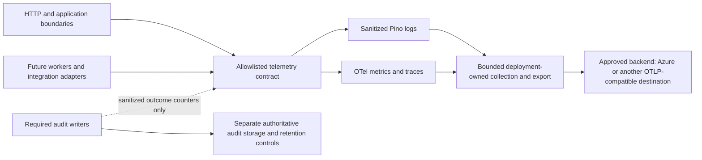

# F061 — Enterprise Observability & Resilience Readiness Assessment

Status: **Architecture approved with required documentation hardening; hardening completed for final F061 acceptance review. No implementation or production-readiness approval.** Assessment date: 2026-10-09. The review authorizes one local documentation-only commit after validation, not telemetry implementation, package installation, monitoring provisioning or migrations.

## 1. Baseline, scope and evidence standard

Fetched authoritative `origin/main`, then created isolated branch `codex/f061-observability-readiness` in `.local-uat/f061-observability-readiness` at `b805919e8de226bef3c1eea9fb63d0aeb3c67495`. Main and the new worktree were clean; the new index was empty, 0 ahead / 0 behind origin/main. The baseline includes ADR-029, ADR-030, the PIM evidence assessment and private-ingress readiness assessment. Initial sandbox networking could not reach GitHub; the authorized fetch succeeded with the required execution permission. No push occurred.

Only this document is added. No ADR number, migration, dependency, application/operator/PIM/private-ingress edit, cloud service, monitoring resource, deployment or backup configuration is introduced. No live database or Azure account was inspected. Repository findings do not establish operational controls outside the repository.

Inputs: [execution protocol](../development/REQRO_CODEX_PROTOCOL.md), [context](../CITYVUE_CONTEXT.md), [architecture](../ARCHITECTURE.md), [roadmap](../ROADMAP.md), [security framework](../security/SECURITY_FRAMEWORK.md), [ADR-030 serving contract](../architecture/decisions/ADR-030-production-serving-contract.md), [ADR-029 operator platform](../architecture/decisions/ADR-029-production-operator-platform.md), [PIM evidence assessment](F060-3C-2E-2B-pim-evidence-contract-assessment.md), [private-ingress assessment](F060-4A-2B-0-edge-private-ingress-iac-readiness.md), [ADR-026 notifications](../architecture/decisions/ADR-026-outbound-notification-delivery-architecture.md) and [F016 hosting prerequisites](F016-production-hosting-deployment-readiness-plan.md). Existing approvals remain unchanged. Historical checkpoint text does not override inspected code/Git state.

**Existing** below means inspected source or repository evidence, not a fresh passing test or deployed capability. **Proposed** means a future contract subject to review. All numerical targets are provisional planning candidates, not production measurements, client commitments or achieved SLOs.

## 2. Current capability and gap inventory

| Area                       | Existing evidence                                                                                                                                                                                                                                                                              | Gap/operational consequence                                                                                                                                                        |
| -------------------------- | ---------------------------------------------------------------------------------------------------------------------------------------------------------------------------------------------------------------------------------------------------------------------------------------------- | ---------------------------------------------------------------------------------------------------------------------------------------------------------------------------------- |
| Structured logs            | [Pino logger](../../server/src/common/logging/pino-logger.service.ts) sanitizes at log invocation and output, including child bindings; closed messages and fields.                                                                                                                            | No inspected centralized ingestion, retention/access policy, telemetry health dashboard or export-loss evidence. Do not replace its protections with default auto-instrumentation. |
| Request correlation        | [Request middleware](../../server/src/common/logging/request-logging.middleware.ts) generates server-owned UUIDs, ignores incoming IDs and returns `x-correlation-id`; status/duration and framework route template are logged.                                                                | Not distributed trace context; no durable background-delivery correlation contract. Request UUIDs are lookup keys, not metric labels or authority.                                 |
| Sanitized failures         | [Sanitizer](../../server/src/common/logging/log-sanitization.ts), [exception filter](../../server/src/common/errors/http-exception.filter.ts) and startup handling use closed failure classifications, not raw exception details.                                                              | Tracing/log bridges must preserve this at every export path; current sanitizer would discard unapproved new trace/resource fields.                                                 |
| Tenant evidence            | [Tenant middleware](../../server/src/tenancy/tenant-resolution.middleware.ts) records bounded outcomes/reasons/duration and canonical resolved hostname/role.                                                                                                                                  | Canonical hostname is still customer-identifying metadata. Keep restricted existing logs; omit/remap for general exports and metrics. Not proof of tenant isolation by itself.     |
| Version metadata           | `APP_VERSION` defaults to `0.1.0`; operational metadata allows a constrained numeric semantic version, service `cityvue-api` and environment.                                                                                                                                                  | App logs have no verified build SHA/image digest/config-release identity. Do not put SHA into the existing version field or rename runtime identifiers.                            |
| Health                     | [Health controller](../../server/src/health/health.controller.ts): `/api/v1/health/live`, `/health` and `/health/ready` under the same API prefix. [Service](../../server/src/health/health.service.ts) returns process metadata; readiness adds DB status.                                    | No real-hostname launch proof or optional-dependency readiness model. Healthy process/database is not healthy resident service.                                                    |
| Database bounds            | [Database service](../../server/src/database/database.service.ts) uses a bounded pool, connection timeout, statement timeout, verified TLS configuration and sanitized failures; `status()` runs `select 1`; shutdown destroys the pool. Defaults are pool 10, connection 5 s, statement 30 s. | Defaults are not workload-tested timeout budgets. No observed pool-wait/lock/replication/backup metrics. Readiness timeout is not an independently tuned cheap probe.              |
| Shutdown/throttling        | `bootstrap.ts` enables shutdown hooks and existing API throttling.                                                                                                                                                                                                                             | No demonstrated load/drain/cancellation/restart resilience or end-to-end overload policy. Proxy-IP throttling limitations in ADR-030 remain.                                       |
| Idempotency                | Creation code returns original receipts on applicable retries; Notes/Communication have explicit idempotency contracts.                                                                                                                                                                        | Do not infer universal mutation replay safety or exactly-once external effects.                                                                                                    |
| Audit/activity             | [Contact service](../../server/src/service-request/request-contact.service.ts) waits for audit transaction commit before disclosure; tenant-domain/attachment/configuration audits and operational Activity exist.                                                                             | Transactional integrity and append-only application controls do not prove off-host immutability, complete security-event coverage or retention.                                    |
| Operator evidence          | [Operator audit](../../server/src/config/operator-audit.ts) records invocation start/outcome, code/image provenance and identity context; start failure prevents execution, outcome-write failure must not mask original result.                                                               | Only stream adapter is permitted in serving; stderr durability is runner-dependent, not an immutable archive. PIM gate remains disabled/fail-closed pending its own workstream.    |
| Integrations/notifications | No enterprise integration router/adapter; [notification registry](../../server/src/notifications/notification-provider-registry.ts) intentionally empty; ADR-026 outbox/worker/transport remain future.                                                                                        | Queue/delivery/email SLIs must be marked not implemented, never green or zero failures. Recorded correspondence is not delivered mail.                                             |
| AI/GIS                     | [AI registry](../../server/src/ai/ai-provider-registry.ts) empty; location eligibility has a development provider.                                                                                                                                                                             | No live AI or authoritative GIS provider, associated SLO or production dependency evidence.                                                                                        |
| Metrics/traces/recovery    | No configured OTel/Prometheus/Application Insights packages or telemetry graph found in package manifests; no backup/PITR/restore automation/evidence found in inspected tracked scripts/runbooks.                                                                                             | No measured SLO, tested RPO/RTO or production observability/recovery claim. Existing frontend dashboards are not platform operations dashboards.                                   |

Relevant regression evidence exists in `server/test/unit/logging-sanitization.test.ts`, `server/test/e2e/logging.e2e.test.ts`, health unit/E2E tests, authority/tenancy tests and database isolation/audit tests. These were inspected as validation targets, not rerun for this documentation slice.

## 3. Provider-neutral observability architecture

### Responsibility split for this phase

| Component           | Responsibility                                                                                                             | Authority boundary                                                                                                                                                                      |
| ------------------- | -------------------------------------------------------------------------------------------------------------------------- | --------------------------------------------------------------------------------------------------------------------------------------------------------------------------------------- |
| Pino                | Sanitized operational application logs, preserving existing allowlists and output sanitization.                            | Reqro's chosen operational logging path for this phase; correlate records with traces without replacing the logger or weakening sanitization.                                           |
| OpenTelemetry       | Distributed traces and metrics through provider-neutral contracts.                                                         | Optional diagnostic/measurement signals, not authoritative audit records. OpenTelemetry JavaScript log support is **not** the chosen Reqro logging authority for this phase.            |
| Reqro audit storage | Authoritative security/business audit evidence under its existing persistence, authorization and required-write contracts. | Telemetry must never replace these records. The existing operator stream adapter's durability gap remains unresolved; this split does not claim immutable storage has been implemented. |

**Recommendation:** adopt OpenTelemetry APIs, context and OTLP as the future provider-neutral metrics/tracing contract at infrastructure/application boundaries. Retain sanitized Pino JSON logs initially. Do not introduce telemetry SDK objects into ServiceRequest, Organization, authorization policies or integration payload schemas. Azure Monitor/Application Insights is an optional deployment adapter, never a domain dependency.

OpenTelemetry's [JavaScript status](https://opentelemetry.io/docs/languages/js/) lists traces/metrics as stable, logs as development and browser instrumentation as experimental. Therefore defer any Pino-to-OTel log bridge and browser instrumentation until compatible versions, privacy behavior and duplicate-log prevention are verified. Pin SDK/instrumentation/semantic-convention versions for the repository's supported Node/Nest/Express/pg versions; prove startup ordering, context propagation, overhead and shutdown in a separate local spike. Do not install a broad auto-instrumentation bundle unreviewed.

### Telemetry envelope and instruments

| Contract           | Proposed allowed shape                                                                                                                                         | Boundary/limit                                                                                                                            |
| ------------------ | -------------------------------------------------------------------------------------------------------------------------------------------------------------- | ----------------------------------------------------------------------------------------------------------------------------------------- |
| Resource identity  | Existing service identity plus validated `service.version`, environment, deployment alias, immutable build SHA/image digest and config-release hash/reference. | Trusted deployment metadata; no full environment dump. Commit/config metadata does not prove actual rollout; reconcile deployment events. |
| Operational event  | UTC event time, server request ID, optional validated trace/span IDs, closed event/outcome/error code, framework route, duration, bounded component/operation. | No free-form object serialization. Explicit sanitizer changes require tests, not bypasses.                                                |
| Request metrics    | Eligible/completed/failed counters and duration histogram; in-flight requests and rejections.                                                                  | Finite route/operation/method/status-class labels; unmatched route is one bucket, never raw URL.                                          |
| Dependency metrics | Duration/outcome, timeout, breaker state, concurrency, pool/queue saturation and cancellation.                                                                 | Finite dependency aliases/adapter kinds, not URLs, SQL text, customer names or error messages.                                            |
| Future delivery    | Intents due/confirmed/expired, oldest age, attempt count and dead-letter/backlog gauges.                                                                       | Logical intent counted once for delivery SLI; attempts measured separately. No recipient or message body labels.                          |
| Trace spans        | HTTP server, tenant resolution, authorization boundary, coarse DB operation, future adapter/worker operation with closed outcome.                              | No SQL statement/parameters, exception stack/message, credentials, body, unrestricted URL or arbitrary attributes.                        |
| Collection health  | Dropped/refused exports, queue saturation, export failures, last successful ingestion and schema rejection count.                                              | Telemetry outages must be visible independently; missing signal is unknown, not success.                                                  |

Histogram units/boundaries, outcome vocabulary and maximum series budgets are schema-versioned configuration reviewed before coding. Measure counts without trace sampling; compute SLOs from unsampled counters or authoritative intent totals, not sampled spans. Request/trace/intent IDs belong only in restricted event lookup, never metric dimensions. Cap resource cardinality during rollout; opaque tenant UUIDs are still high-cardinality identifiers.

### Correlation and trust boundaries

| Identifier           | Meaning                                                                                                         | Required preservation                                                                                                                  |
| -------------------- | --------------------------------------------------------------------------------------------------------------- | -------------------------------------------------------------------------------------------------------------------------------------- |
| Reqro correlation ID | Existing server-generated Reqro UUID used for request/error/log correlation and returned as `x-correlation-id`. | Preserve its generation and existing contract. Never replace it with a caller ID, W3C trace ID or span ID.                             |
| W3C trace ID         | Identifies a distributed trace in the approved tracing context.                                                 | Separate from Reqro's UUID; may be linked to it through reviewed sanitized fields. It is not tenant, authentication or audit identity. |
| Span ID              | Identifies an individual operation within a trace.                                                              | Separate field and lifecycle; neither the trace ID nor the Reqro UUID is replaced by it.                                               |

These identifiers may be linked, but must not replace one another. Inbound trace context never becomes tenant authority, authentication authority or audit identity. Future outbound integrations may propagate safe trace/correlation context only under their approved contracts, with destination and field allowlists; this does not authorize forwarding arbitrary inbound context.

Keep the server-owned response correlation ID. Proposed external ingress starts a fresh trusted trace; reject/drop malformed or untrusted incoming trace context and baggage rather than treating them as identity. Approved internal hops may continue validated W3C context after authenticated infrastructure admission. Neither trace context nor baggage may select Organization, principal, permissions or sampling priority. A remote parent, if retained as a reviewed link, remains untrusted metadata, not an authoritative audit correlation key.

Future background jobs carry a separately generated logical operation ID, attempt ID and origin trace link alongside their immutable, authoritatively established Organization binding. Do not serialize an HTTP request, token or AsyncLocalStorage object into a job. Worker scope is re-established and cleared per job; concurrent two-tenant tests must prove no context bleed. Replay/retry links to the original operation but gets a new attempt span. Propagate trace context only to approved adapter destinations, never arbitrary user-supplied URLs. Empty allowlist means no baggage propagation.

OTel warns that [baggage can reach unintended downstream services](https://opentelemetry.io/docs/concepts/signals/baggage/). Adopt source-side minimization and a second export allowlist, consistent with [its sensitive-data guidance](https://opentelemetry.io/docs/security/handling-sensitive-data/); collector redaction is defense in depth, not permission to collect forbidden data first.

### Optional telemetry failure versus required audit

Metrics/traces are best-effort, bounded and nonblocking for application correctness. A disconnected exporter must not cause unbounded memory/disk, synchronously stall a request or convert a committed business success into a failure. Define queue/flush/time budgets, drop accounting, shutdown deadline and a safe no-op mode; test logging backpressure too. Sample low-value traces under load with bounded error retention; do not promise all errors are retained. SLO counters remain unsampled, with collection loss reported.

The [Collector resilience model](https://opentelemetry.io/docs/collector/resiliency/) describes bounded queues/retries and remaining data-loss modes even with persistence. No durable broker or extra cloud service is justified solely to claim lossless telemetry. Any local export spool needs approved disk quota, encryption/access and retention. Required audit writing remains a different fail-closed contract, including existing start-before-operator-execution and audit-before-disclosure rules. A healthy telemetry backend cannot substitute for required audit persistence.

### Azure reference mapping, not provisioning

| Neutral capability    | Possible Azure mapping                                                                     | Decision still needed                                                                                                                           |
| --------------------- | ------------------------------------------------------------------------------------------ | ----------------------------------------------------------------------------------------------------------------------------------------------- |
| Application signals   | Application Insights/Azure Monitor via a deployment-owned compatible exporter/distro.      | Prove supported Node signals and OTLP path for pinned versions; do not assume every generic Collector exporter works with Application Insights. |
| Sanitized logs        | Approved Azure Monitor Logs destination, separately routed from restricted audit evidence. | Ingestion/export redaction, RBAC, region, quotas, retention and deletion policy.                                                                |
| Infrastructure health | ACA/PostgreSQL/Front Door platform metrics and diagnostics.                                | Managed telemetry can contain URLs/IPs; inspect/filter before wider ingestion and export.                                                       |
| Alerting              | Azure alert rules/action routing or another backend.                                       | Owner/on-call coverage, privacy-safe payloads, maintenance and escalation.                                                                      |
| Audit archive         | Separately approved immutable storage/evidence service.                                    | Security-owned immutability, write/read separation, retention/legal hold and verification. Not ordinary Application Insights traces.            |

[Microsoft's OTel guidance](https://learn.microsoft.com/en-us/azure/azure-monitor/app/opentelemetry-enable?tabs=nodejs) documents its distro route. Treat configuration, offline storage, exporters and automatic instrumentation as deployment adapters to evaluate, not mandatory cloud dependencies. Choose one reviewed log ingestion path to avoid duplicate Pino records. No connection string, ingestion endpoint, managed identity, workspace or backend is configured here.

## 4. SLI, SLO and alert contract

**SLI** is the measured ratio/distribution with explicit population and clock. **SLO** is its approved target over a window. **Alert threshold** decides when responders act; it is not the SLO itself. Recommend a rolling **28-day** evaluation window and the following **provisional discussion targets only**. Product/service owners must approve targets after baseline measurement, workload/cost assessment and dependency agreements. No production measurements exist in this assessment.

| Service/journey                   | SLI numerator / denominator and measurement point                                                                                                                                                            | Provisional SLO                                                                                               |
| --------------------------------- | ------------------------------------------------------------------------------------------------------------------------------------------------------------------------------------------------------------ | ------------------------------------------------------------------------------------------------------------- |
| Resident API availability         | Valid expected resident requests receiving contract-correct responses within 2 s / eligible requests arriving at approved edge; combine edge and app evidence without double counting.                       | 99.9% within 2 s. Creation measured separately below.                                                         |
| Staff API availability            | Eligible authenticated staff requests receiving correct authorized response within 2 s / eligible staff requests; include identity dependency outages affecting valid users.                                 | 99.9% within 2 s.                                                                                             |
| Service-request creation          | Valid logical submissions with durable canonical commit and correct original receipt within 5 s / eligible logical submissions due; reconcile lost responses and retries without double-counting success.    | 99.5% within 5 s; zero observed duplicate side effects is a separate correctness invariant.                   |
| Tracking lookup                   | Valid active tracking credentials receiving the authorized current projection within 2 s / eligible lookups; instrumentation sees only safe outcome, never credential.                                       | 99.9% within 2 s.                                                                                             |
| Alert/catalog reads               | Contract-correct reads within 1 s / eligible reads, split by alert/catalog operation; empty legitimate lists count good.                                                                                     | 99.9% within 1 s.                                                                                             |
| Integration delivery, future only | Durable intents with confirmed adapter-level acceptance within 5 min / all eligible intents whose 5-min deadline has elapsed, including pending/failed/dead-lettered.                                        | 99% within 5 min; business completion in external system is a separate negotiated SLI.                        |
| Operator execution                | Invocations reaching the correct terminal result, with required evidence, inside the approved command budget / eligible invocations due. Track authorized mutation success separately from correct refusals. | 99% within a provisional 15-min ceiling; command-specific budgets and PIM readiness must be approved first.   |
| Tenant resolution                 | Requests on expected active bindings resolving to the correct expected Organization within 250 ms / such eligible resolutions, measured internally without exposing mappings.                                | 99.99% within 250 ms; **zero wrong-tenant resolutions** is a safety invariant, not an error-budget allowance. |

Eligibility must be defined before failure, not by excluding failed responses. Genuine invalid credentials/input, correct authorization denial and requests for unapproved hosts are tracked separately; exclude them from a successful-user denominator only with a trusted closed classification. Count capacity-induced 429s, 5xx, server timeouts and platform false denials affecting valid requests as bad. Do not exclude a genuine request merely because an outage made tenant/auth/configuration resolution impossible. Current Entra code catches JWKS/validation errors as generic 401: status-only metrics cannot distinguish a valid-user outage from invalid credentials. A separately reviewed non-sensitive cause counter and authorized synthetic login/read probe are needed; public error semantics remain unchanged.

No traffic means **insufficient data**, not 100%. Disabled/unimplemented integration, mail, AI and operator-production capability is **not applicable/not ready**, not green. Measure ingestion coverage, dropped counts, restarts and unobserved edge failures. Publish both user-visible external availability and conditional in-process SLIs; do not average component percentages into end-to-end availability. Probes from outside the edge catch DNS/TLS/no-arrival failures absent from application counters. Use only approved synthetic domains/accounts/data; never retain tracking credentials in the probe evidence. Customer success windows and platform clocks must be distinguished.

For each approved ratio, error budget is `eligible × (1 − target)`; burn rate is observed bad fraction divided by `(1 − target)`. Proposed starting alert policy: page when burn exceeds 14.4 in **both** 1 h and 5 min windows, or 6 in **both** 6 h and 30 min windows; ticket on sustained slower burn. These are provisional tuning candidates, not enabled alerts or claims of exact budget depletion. Require sufficient denominator, separate low-volume synthetic outage detection and telemetry-staleness alerts. Security isolation failures page immediately regardless of burn; budget is never permission to leak data. The distinction follows [Google SRE's multi-window burn-rate guidance](https://sre.google/workbook/alerting-on-slos/).

Creation latency versus dependency budgets is unresolved: current DB statement timeout can exceed the proposed 5 s journey target. A target is not authorization to lower timeouts, cancel writes blindly or weaken existing tests. Measure p50/p95/p99, queue/DB time and cancellation/commit ambiguity first. Review budgets and safe retry behavior before implementation; preserve known baseline test exceptions without changing their classification.

### Required SLO record for every proposed target

Every SLO requires a versioned record containing its **SLI definition, numerator, denominator, measurement window, target and approval status, error budget, named service owner, alert/burn-rate strategy, tenant-versus-platform scope, and planned-maintenance/dependency-failure treatment**. The eight SLI rows above and the scope/ownership table below form the initial records. All use a rolling 28-day window and remain **provisional/unapproved**. Percentages are not approved production commitments. Accountable individuals and approval dates are still TBD; role suggestions below do not appoint an owner.

Let `N` be the eligible denominator from the corresponding SLI row, evaluated over the same window. Each row inherits the multi-window burn-rate candidates and low-volume/stale-signal safeguards above; correctness/security violations remain immediate incident conditions outside any reliability budget.

| SLO record               | Provisional error budget                         | Owner role to nominate                                  | Scope and alert emphasis                                                                                                                                          |
| ------------------------ | ------------------------------------------------ | ------------------------------------------------------- | ----------------------------------------------------------------------------------------------------------------------------------------------------------------- |
| Resident API             | `0.001 × N` bad eligible requests                | Resident API service owner                              | Each tenant deployment separately; platform aggregate is supplemental. API burn plus outside-in DNS/TLS probes.                                                   |
| Staff API                | `0.001 × N` bad eligible requests                | Staff API service owner, with identity dependency owner | Each tenant deployment; platform dependency view does not hide one tenant's outage. Burn includes valid-user identity failures.                                   |
| Service-request creation | `0.005 × N` failed/late logical submissions      | Intake service owner                                    | Tenant-scoped logical submissions; burn/timeout and receipt-reconciliation alerts. Duplicate effects are a separate correctness incident.                         |
| Tracking lookup          | `0.001 × N` failed/late eligible lookups         | Tracking service owner                                  | Tenant-scoped authorized lookups, no credential labels. Burn plus approved synthetic lookup coverage.                                                             |
| Alert/catalog reads      | `0.001 × N` failed/late reads for each operation | Resident discovery service owner                        | Separate tenant alert and catalog populations; operation burn, not a combined ratio hiding one failure.                                                           |
| Integration delivery     | `0.01 × N` unconfirmed/late due intents          | Integration delivery service owner                      | Per tenant and approved connector class; delivery burn plus backlog/dead-letter/deadline alerts. Not applicable until implemented.                                |
| Operator execution       | `0.01 × N` incorrect/late terminal outcomes      | Operator platform service owner, with security owner    | Per isolated deployment/operation, restricted platform aggregation; burn plus missing-evidence alerts. Required audit failure is not budget-authorized execution. |
| Tenant resolution        | `0.0001 × N` failed/late eligible resolutions    | Tenant-resolution service owner                         | Per deployment's expected active bindings; burn plus immediate wrong-tenant incident. No raw hostname/Organization metric dimensions.                             |

**Maintenance rule applying to every record:** planned maintenance remains in the user-visible denominator and error budget by default. Any separately approved adjusted reporting must publish both inclusive and adjusted views with explicit window/approval; no silent exclusion. **Dependency rule applying to every record:** if a dependency failure prevents an eligible operation meeting its contract, it consumes that service's budget regardless of internal/external ownership. Cause-specific dependency SLIs supplement rather than erase the impact. Optional dependencies outside that journey do not expand its denominator. Platform aggregation cannot conceal a failed tenant SLO, and scope-specific metrics must obey the privacy/cardinality restrictions below. Zero eligible volume or incomplete measurement remains unknown/insufficient data.

## 5. Health, readiness and launch evidence

| Layer                          | Existing/proposed meaning                                                                                                      | Safe contract                                                                                                                                                                                    |
| ------------------------------ | ------------------------------------------------------------------------------------------------------------------------------ | ------------------------------------------------------------------------------------------------------------------------------------------------------------------------------------------------ |
| Process liveness               | Existing `GET /api/v1/health/live` confirms the process responds, with service/version.                                        | No DB, identity-provider, registry or outbound-provider fan-out. A DB outage must not cause liveness-driven restart storms.                                                                      |
| Core readiness                 | Existing `GET /api/v1/health` and `/api/v1/health/ready` run `select 1`; 200 includes `database: up`, otherwise generic 503.   | This proves neither schema compatibility nor writes/audit capability. Preserve public generic response; consider bounded probe timeout, coalescing and hysteresis in a later slice.              |
| Startup/deployment readiness   | Proposed private preflight for valid serving configuration, expected schema/version and required writable/secret dependencies. | No mutation or privilege escalation to make a probe pass. Check compatibility through approved metadata access; no migration or registry activation in a health endpoint.                        |
| Capability/dependency health   | Proposed internal snapshot of IDP key-fetch state, isolated runtime DB/pool, audit sink, and enabled optional adapters.        | Bounded asynchronous checks, closed enums and freshness; no external request per public health call. An optional AI outage must not drain the whole API.                                         |
| Worker readiness, future       | Ability to accept work with required store/provider state and bounded backlog.                                                 | Stop accepting/leasing safely when required dependencies fail; do not label an unimplemented queue healthy.                                                                                      |
| Real-hostname launch readiness | Accepted ADR-030 distinction: DNS/TLS/edge/private path/static/API and expected active tenant binding must work together.      | Separately authorized synthetic browser/API evidence on exact real hostname, plus direct-origin/forged-authority negative tests. Zero bindings may boot but cannot pass tenant launch readiness. |

Detailed diagnostics are an authenticated infrastructure/operator surface with its own authorization review, not new public endpoints exposing hosts, tenant IDs, connection strings, DB schema, version hashes or dependency URLs. Public responses must not reveal whether a guessed tenant exists. Readiness checks must be read-only, rate-bounded and avoid overload amplification; polling failure does not silently disable authentication or turn an unverified binding into a default tenant. Avoid publishing SQL, exception messages and certificate secret references. Keep internal certificate expiry and registry-verification evidence out of anonymous health payloads.

## 6. Failure domains and degradation policy

The future behavior below preserves current security semantics; it does not assert that missing integrations/workers are implemented.

| Failure domain                                | Required behavior                                                                                                                                                                                                                                                                  | Operational evidence/recovery                                                                                                                                                       |
| --------------------------------------------- | ---------------------------------------------------------------------------------------------------------------------------------------------------------------------------------------------------------------------------------------------------------------------------------- | ----------------------------------------------------------------------------------------------------------------------------------------------------------------------------------- |
| PostgreSQL unavailable/exhausted              | Canonical reads/writes and audit-dependent disclosure fail closed with safe unavailable responses; no browser-local legacy persistence or stale cross-tenant fallback. Static error shell and process liveness may remain available.                                               | Bounded pool wait/timeout and closed DB cause; readiness down; no blanket transaction retries. Reconcile ambiguous commit before retrying a mutation.                               |
| External integration unavailable              | Future canonical receipt may succeed only under an approved durable delivery contract; mark delivery pending/failed separately. Never claim external work completion.                                                                                                              | Adapter circuit/backlog/age/attempt evidence; preserve tenant-bound durable intent. Without approved durability, do not pretend to enqueue.                                         |
| Identity provider/JWKS unavailable            | Protected staff work refuses if identity cannot be verified. Existing cryptographically valid cached-key behavior may continue within reviewed library policy; no expired-token or cached-principal bypass. Resident capabilities remain independent where their contract permits. | Closed fetch/validation failure counts, synthetic identity availability and key-refresh freshness. Current generic 401 is not a reliable outage classifier. No token/claim logging. |
| DNS/edge/TLS failure                          | Public service unavailable; never direct users to raw origin/provider domain, HTTP mutation endpoint or another tenant.                                                                                                                                                            | External probes, certificate validity, edge status and recent deployment/config references; preserve ingress invariants during rollback.                                            |
| Queue/event delivery failure                  | Future worker pauses/backpressures; accepted work stays durable, partitioned and visible. No acknowledgement before durable acceptance, no silent discard.                                                                                                                         | Backlog/oldest age, lease/attempt/outcome and dead-letter counts. Idempotent reconciliation before replay. No broker exists currently.                                              |
| Email/notification unavailable                | Canonical request/recorded correspondence retains its real outcome; do not say sent/delivered. Disable only unavailable optional delivery capability.                                                                                                                              | Future notification intent/attempt/provider confirmation are separate states under ADR-026; no automatic fallback to an unapproved provider/channel.                                |
| AI unavailable                                | Preserve manual staff workflow if independently authorized; clearly show unavailable suggestion, never fabricate generated output or bypass required review.                                                                                                                       | Closed provider outcome/latency; no prompts, completions, Notes or resident data in telemetry. Registry is empty today.                                                             |
| GIS unavailable                               | Optional map enrichment may degrade to already-approved manual input; mandatory eligibility remains unable-to-determine/unavailable, not eligible by default.                                                                                                                      | Separate transport availability from policy outcome; synthetic geographic fixtures; no coordinates/addresses in telemetry. No invented authoritative provider.                      |
| Partial tenant configuration/registry failure | Affected capability refuses safely within that tenant; unknown/unverified host never receives default content. Healthy isolated deployments continue.                                                                                                                              | Closed configuration/version/result codes and restricted deployment alias; no enumeration endpoint or host-dependent public diagnostic details.                                     |
| Optional observability backend failure        | Continue correct business work with bounded loss of optional telemetry and independent signal-gap alert.                                                                                                                                                                           | Queue/drops/freshness with controlled memory/disk; no recursive logging storm. Required audit behavior is unchanged.                                                                |
| Required audit failure                        | Prevent the operation/disclosure wherever current contract requires it. An operator outcome-write failure after work is an unresolved evidence gap, not grounds to repeat the mutation or erase its outcome.                                                                       | Restricted incident, start/outcome reconciliation and authoritative DB evidence; no downgrade to best-effort traces.                                                                |

## 7. Resilience patterns and limits

These are future boundary policies, not a blanket resilience library installation.

| Pattern                       | Recommended contract                                                                                                                                                                                                            | Verification before adoption                                                                                                                                        |
| ----------------------------- | ------------------------------------------------------------------------------------------------------------------------------------------------------------------------------------------------------------------------------- | ------------------------------------------------------------------------------------------------------------------------------------------------------------------- |
| Retries                       | Retry only transient, classified failures for safe reads or operations with an explicit tested idempotency contract. Bounded exponential backoff/jitter, cap attempts and total elapsed budget; respect approved retry signals. | Separate attempts from logical operations; timeout-after-commit, duplicate delivery and interrupted-response tests. No retry on auth/policy/config/schema failures. |
| Retry ownership               | One layer owns retry; disable multiplicative client/proxy/SDK/worker retries. Operator mutations never automatically replay because of missing telemetry or ambiguous exit.                                                     | Inspect all configured SDK/edge/worker behavior and worst-case amplification.                                                                                       |
| Circuit breakers              | Per dependency/approved deployment boundary, finite state, bounded half-open probes and recovery hysteresis.                                                                                                                    | Avoid a shared breaker causing one tenant's failures to deny every customer; no bypass of identity/authorization/registry checks on open state.                     |
| Bounded concurrency/bulkheads | Separate resident request, staff request, future worker and provider budgets; explicit DB pool/queue capacity.                                                                                                                  | Load tests with hot tenant and failed provider; no unbounded promise fan-out or indefinite connection wait.                                                         |
| Backpressure                  | Reject overload early with reviewed status/Retry-After; bound queue age/bytes/items; don't enqueue silently after telling user failure.                                                                                         | No work loss, retry storm or duplicate request under surge. Preserve body/attachment limits.                                                                        |
| Timeout budgets               | End-to-end deadline allocated to admission, validation, DB/adapter and response; reserve cancellation/cleanup time. Propagate deadlines through approved internal context only.                                                 | DB transaction cancellation and unknown-commit handling; do not merely shrink current 30 s statement timeout to match proposed SLO.                                 |
| Graceful shutdown             | Stop accepting work, drain in-flight operations within deadline, release worker leases safely, close DB/exporter with bounded flush.                                                                                            | Existing shutdown hooks are foundations; prove SIGTERM/revision drain/forced kill without duplicate effects or dangling audit state.                                |
| Dependency isolation          | Lazy optional capabilities, independent resource budgets; resident core doesn't depend on optional AI/email dashboards.                                                                                                         | Fault injection with synthetic dependencies; no live credentials or customer data.                                                                                  |
| Regional recovery             | Restore/redeploy the **same** customer boundary to an approved region, fencing the old writer and preserving verified domains/identity/keys.                                                                                    | Restore drill, RPO/RTO and split-brain prevention; no automatic cross-tenant origin, shared database or public-origin fallback.                                     |

Regional redundancy is not introduced by telemetry or a second origin. Database/attachments/audit/configuration/identity dependencies need a coherent recovery design and approved cost/availability requirements. Restore-first/manual failover is the assessment default until controlled exercises justify automation. Do not convert ADR-030 deployment-per-tenant into shared SaaS.

## 8. Audit, Activity and telemetry are different records

| Record                  | Purpose/authority                                                                                                                         | Storage and failure contract                                                                                                                                      |
| ----------------------- | ----------------------------------------------------------------------------------------------------------------------------------------- | ----------------------------------------------------------------------------------------------------------------------------------------------------------------- |
| Security audit          | Who attempted/accessed/changed protected resources under what server-validated authority; required evidence for specific actions.         | Dedicated governed schema/sink, access controls, retention and append-only/immutability requirements. Required writes retain transactional/fail-closed semantics. |
| Business Activity/audit | Factual lifecycle/change history within authorized business views. Some narrative may be sensitive and belongs only in protected records. | Existing Organization-scoped persistence and authorization, not copied wholesale into operations tools.                                                           |
| Operational logs        | Diagnose bounded events and failures; correlate requests/deployments.                                                                     | Sanitized, possibly lossy/retained for an approved limited period; not authoritative proof of a committed mutation.                                               |
| Metrics                 | Aggregate health, throughput, latency and SLO evaluation.                                                                                 | Bounded series, unsampled SLI counts, no record-level personal/customer identifiers.                                                                              |
| Traces                  | Sampled causality and timing between instrumented operations.                                                                             | Restricted short-lived diagnostics; absence proves neither lack of activity nor audit completeness.                                                               |

Keep operator `OperatorAuditSink` separate even though today's adapter writes JSON to stderr: transport similarity does not make its records ordinary telemetry. It contains intentionally restricted actor/Organization/hostname/provenance evidence; export routing must not copy that envelope into general logs. Immutable off-host retention remains unimplemented. Do not assign telemetry retention from the operator workstream's separate policy or modify its PIM predicate/evidence schema. Security investigators must verify durable audit/transaction records independently; metrics or sampled traces can guide, not replace, that investigation.

## 9. Incident evidence contract

Each incident needs an assigned commander/service owner, detection source/time, severity, affected deployment aliases, mitigation decisions and a restricted evidence location. No real recipients, tickets or on-call schedule are invented here.

| Purpose                | Minimum evidence                                                                                                                                             | Privacy/integrity controls                                                                                                                            |
| ---------------------- | ------------------------------------------------------------------------------------------------------------------------------------------------------------ | ----------------------------------------------------------------------------------------------------------------------------------------------------- |
| Detection              | SLI numerator/denominator/window, sample coverage, burn or synthetic failure, telemetry freshness, impact and closed failure classes.                        | Alert title/payload contains no customer hostname, resident reference or secret; links require authorization.                                         |
| Timeline               | UTC event and ingestion times, clock-skew/freshness, server request/trace/operation IDs, component sequence and deployment/config versions.                  | Preserve missing intervals, sampling/drop counts and uncertain ordering; never fabricate a complete trace from partial events.                        |
| Tenant isolation       | Trusted resolved context in restricted audit, expected deployment→Organization mapping, access decision and relevant negative-test evidence.                 | Wrong-tenant result is a critical incident. Use scoped evidence access; no multi-tenant raw data dashboard or copying records from unrelated tenants. |
| Rollback               | Deployed commit/image/config digests, rollout times, approvals, compatible migration state, last good release and immutable artifact provenance.             | Telemetry version tags alone are not proof; reconcile release records. Don't restore old credentials/privileges or repeat mutations on rollback.      |
| Security investigation | Authoritative audit linkage, authorization/identity validation classification, sanitized boundary/refusal evidence, collection integrity and access history. | Restricted chain of custody, hashes, UTC timestamps, export approvals and retention/legal hold; no token/PII dumps for convenience.                   |

Never log bearer tokens, tracking credentials, secrets, request bodies by default, unrestricted query strings, raw forwarded-host chains or resident PII. This also prohibits SQL bind values, raw provider responses, AI prompt/completion text, precise location and unrestricted error objects in traces/metric exemplars. Treat exception messages/stacks and HTTP auto-instrumentation defaults as unsafe until proven otherwise. Synthetic reproduction should supply the detail that sanitized production logs deliberately omit; do not disable sanitization to debug an incident.

## 10. Backup, restore and recovery readiness

No configured backup policy, backup catalog, PITR setup, successful restore drill or measured RPO/RTO was found in the inspected repository scripts/runbooks. F016 lists recovery as an unmet prerequisite. Local Docker volumes are persistence, not a verified backup. This finding does not claim no backups exist outside the inspected repository.

| Capability                | Current evidence                                                                          | Required future acceptance evidence                                                                                                                                                                                               |
| ------------------------- | ----------------------------------------------------------------------------------------- | --------------------------------------------------------------------------------------------------------------------------------------------------------------------------------------------------------------------------------- |
| Database backup           | No inspected scheduled backup configuration/evidence.                                     | Approved encrypted backup type/frequency/retention, independent storage/access, failure alerts, integrity checks and deletion protection.                                                                                         |
| Restore testing           | No repeatable restore drill/report found.                                                 | Restore to a dedicated disposable isolated target; validate schema/constraints, data consistency, authorization, attachments/references and audited operations. Record recovery point/time, failures and actual elapsed recovery. |
| PITR                      | No WAL archival/managed PITR evidence found.                                              | Verify retained recoverable window, continuous log coverage, corruption recovery and restore to a chosen time; a provider feature description is insufficient.                                                                    |
| Configuration/IaC         | Source-controlled configuration and readiness design; no implemented serving IaC graph.   | Rebuild from pinned commit/images/modules, approved secret references/rotation and ownership inventory; Git alone cannot restore lost keys or cloud state.                                                                        |
| Tenant restoration        | Deployment-per-tenant contract, no demonstrated restore procedure.                        | Restore only the intended customer's boundary; verify no other tenant bindings/data and revalidate access/identity/hostname activation before routing. Shared-DB selective restore is not assumed.                                |
| Immutable audit retention | Transactional audits and operator stream contract; no immutable off-host retention proof. | Security-approved retention/hold, off-host immutability, independent access, write acknowledgement/integrity, retrieval and loss monitoring; separate backup of ordinary logs is insufficient.                                    |

[PostgreSQL's backup guidance](https://www.postgresql.org/docs/current/backup.html) distinguishes dump, filesystem and continuous-archive approaches. Select against the actual supported database version and required recovery semantics. A possible Azure deployment may use [Flexible Server backup/PITR capabilities](https://learn.microsoft.com/en-us/azure/postgresql/backup-restore/concepts-backup-restore), but region/configuration/retention/restore limitations and actual evidence must be checked; no service or backup is configured here.

Product/data/security owners must approve per-deployment **RPO** (maximum acceptable data loss) and **RTO** (time to verified service restoration), plus exercises, retention, residency and costs. Values remain **TBD**, not zero loss/instant recovery. Measure RTO through DNS/TLS, private ingress, valid tenant binding and safe user workflow, not just database startup.

A restore must not resurrect revoked staff access, tracking credentials, tenant bindings or completed outbound intents. Quarantine restored environment, disable egress/workers, reconcile post-recovery-point authorization/revocation and audit history under approved procedures, rotate credentials where required and deduplicate/reconcile deliveries before release. Preserve original evidence and fence the old writer. Back up authorized object/attachment data, metadata relationships, configuration and required keys consistently; no production attachment store is assumed to exist. Restore/drill/deletion are separately authorized mutations, never part of this assessment.

### Production recovery evidence gate

Backup existence is not proven restore capability. Future launch readiness requires an approved evidence package covering:

- A completed **database restore** into an isolated target, with data/authorization/tenant-boundary verification and measured recovery time.
- A completed **point-in-time recovery** exercise where supported, recording the chosen/recovered point and log coverage. If unsupported, document the limitation and obtain explicit acceptance of an alternative recovery design; never label PITR tested.
- **Application and configuration/IaC recovery** from versioned artifacts, including controlled secret/key references and dependencies outside Git.
- **Version-compatible rollback**, verifying application/schema/configuration compatibility before traffic resumes; never assume reverting an image safely reverses a database change.
- **Audit retention and recovery** evidence, including integrity, access restrictions, off-host retention guarantees and reconciliation of any recovery-point gap. Operational logs do not substitute for audit evidence.
- **Named RPO/RTO ownership** with accountable data/service/operations owners, approved objectives and measured exercise results. Values remain TBD or explicitly provisional until approved; no numerical recovery guarantee is made here.
- A **periodic restore exercise** schedule with a named owner, evidence expiry/retest criteria, and additional exercises after material storage/schema/runtime changes. Cadence requires approval; one successful historic restore is not perpetual readiness.

The release owner must record pass/fail/missing evidence for each item, with timestamp, tested versions, scope and approver. Missing recovery evidence blocks a production recovery-readiness claim even when backup jobs report success. This gate authorizes no backup setup or restore operation in F061 documentation work.

## 11. Dashboard and alert ownership

All dashboards are future restricted operations surfaces, not new resident/admin UI pages. Assign service/on-call owners before alerts are enabled. Dashboard filters are not authorization boundaries.

| Dashboard                    | Signals and decisions                                                                                                                                  | Initial alert class/owner                                                                                                                       |
| ---------------------------- | ------------------------------------------------------------------------------------------------------------------------------------------------------ | ----------------------------------------------------------------------------------------------------------------------------------------------- |
| Platform health              | Edge availability, process/readiness, replicas/restarts, CPU/memory, saturation, deployment changes and collection freshness.                          | User-impact burn/outside-in failure → platform on-call; stale telemetry → monitoring owner.                                                     |
| Tenant health                | Restricted deployment alias, safe configuration/tenant-resolution outcomes, expected-domain readiness and coverage.                                    | Wrong-tenant signal → immediate security incident; partial configuration → responsible deployment owner.                                        |
| API latency/errors           | Resident/staff split, operation histograms, eligible/error counters, cancellation, overload and budget burn.                                           | Sustained multi-window burn → API owner; no arbitrary p99-only paging without volume.                                                           |
| Integration delivery         | Due/confirmed intents, oldest backlog, retries/dead letters, adapter dependency state; explicit not-implemented panel initially.                       | Deadline/backlog exhaustion → integration owner, never notification recipient details.                                                          |
| Operator execution           | Sanitized attempted/completed/refused/failed counts, missing outcome and audit-sink health; production PIM capability marked blocked.                  | Missing required evidence or unauthorized execution → security/operator owner. Do not show raw actors/elevation evidence in generic dashboards. |
| Database health              | Pool occupancy/wait, query-duration buckets, timeouts/locks/deadlocks, storage/replication capacity where available, backup age and restore-drill age. | Imminent exhaustion/unavailable core/backup gap → DB owner; no SQL/row values.                                                                  |
| Certificate/domain readiness | Restricted inventory aliases, certificate expiry/renewal, DNS/edge path and approved Private Link/authority evidence freshness.                        | Renewal/expiry or external probe failure → DNS/TLS/infrastructure owner.                                                                        |

Runbooks must say who acts, what may be read, what requires separate mutation approval, safe mitigation, escalation, rollback and closure evidence. Alert payloads are sanitized and rate/group bounded. Suppression/maintenance windows are explicit, time-limited and visible in SLO reports; do not silently exclude downtime to improve totals. Low-volume probes and human incident reporting supplement ratios, and absence of telemetry produces an unknown-state alert rather than a green panel.

## 12. Tenant/privacy safeguards

### Cardinality and privacy budget

Prohibited telemetry dimensions include resident identifiers, tracking credentials, emails, phone numbers, authorization headers, raw query strings, request bodies, raw/free-form errors and unbounded URL/path values. Service-request identifiers are prohibited as metric labels. This does not create permission to put those values into logs or traces: the existing prohibition on resident PII, credentials, bodies by default and unrestricted diagnostic content remains in force.

Organization/customer identifiers and public hostnames are **restricted operational telemetry**. Their use as any attribute or dimension requires explicit purpose, privacy, access and retention review first; public DNS visibility does not waive that review. Existing canonical-hostname logs do not authorize broad export or metric labeling. The default design omits these identifiers from general telemetry and retains the stricter no-raw-identifier metric policy below.

Metrics require bounded enum-style dimensions drawn from a reviewed schema, with finite values for route template, operation, outcome, component and dependency class. Each instrument must declare an approved maximum series count, label/value limits, resource-cardinality budget and overflow behavior before implementation. Those numerical budgets are TBD pending load/cost review, not unlimited. Reject unknown labels or map to a fixed `other`/`unmatched` bucket; never hash arbitrary paths/IDs into effectively unbounded labels. Drop/rejection counts must themselves remain bounded. Deployment inventory aliases are restricted resource metadata, not permission for arbitrary tenant labels.

1. Default to an isolated collection/export boundary per customer deployment. Cross-deployment aggregation, if approved, uses only bounded aggregates and restricted opaque inventory aliases; it is not shared customer data access.
2. Derive any tenant/deployment alias from trusted configuration/resolved server context, never request headers, baggage or user input. Keep alias mapping separately access-controlled. Pseudonymization is not anonymization; stable hashes of guessable hostnames are inadequate privacy protection.
3. Do not add Organization UUID, request reference, hostname, email, IP, coordinates, tracking credential or user ID as metric labels. Use finite operation/route/outcome sets with series caps and schema rejection. High-cardinality correlation IDs exist only in restricted logs/traces with approved retention.
4. Existing canonical hostname logging is restricted metadata, not an endorsement of broad export. Review source-side minimization in a future slice and filter at collection as defense in depth; no logging behavior changes here.
5. Protect collection endpoints with approved transport/authentication, export destination allowlists, tenant-scoped credentials and backend RBAC. No unauthenticated public metrics endpoint. Verify storage/query/export authorization, not just a tenant filter on the UI.
6. Test AsyncLocalStorage/concurrent jobs, forged propagation, exporter retries and exception paths for cross-tenant context leaks. Canary forbidden values must never appear in serialized logs, spans, metrics, spool files or alert payloads.
7. Retention, location, access reviews, deletion and investigation holds are separately approved per signal class. Browser telemetry/session replay is not included; enabling it later requires its own privacy/consent and redaction review.

## 13. Proposed implementation slices and release gates

### F062 interface boundary

F061 may expose provider-neutral observability concepts for future F062 integration delivery: **delivery latency, retry counts, dead-letter counts, connector health and reconciliation failure**. Definitions must distinguish logical deliveries from attempts and use only approved bounded operation/connector/outcome categories. F062 may map its separately approved execution contract to those concepts and propagate safe trace/correlation context under that contract.

F061 does **not** define the F062 event schema, event envelope, payload fields, delivery mechanism or persistence model. Those belong to F062 review. Integration telemetry must not depend on Azure Monitor identifiers, types or APIs; Azure Monitor remains an optional deployment backend. This interface neither starts F062 nor authorizes integration implementation or cloud provisioning.

These names sequence work; they allocate no ADR and authorize no implementation.

| Slice                               | Deliverable                                                                                                         | Required gates                                                                                                                         |
| ----------------------------------- | ------------------------------------------------------------------------------------------------------------------- | -------------------------------------------------------------------------------------------------------------------------------------- |
| F061-A — schema/privacy spike       | Versioned safe telemetry envelope, outcome catalog and serializer tests; in-memory exporter fixtures.               | Approve field/cardinality/retention contracts and any new dependencies. Prove current sanitization is preserved and no tenant leakage. |
| F061-B — server metrics/tracing     | Selective Node OTel instrumentation, trusted correlation and bounded export seam; retain Pino.                      | Benchmark context/overhead/memory; prove exporter outage/backpressure/shutdown safety and unsampled counters; no cloud resources.      |
| F061-C — health/SLI instrumentation | Core/capability diagnostics, internal safe auth-failure classification, SLI population/clock and coverage rules.    | Security review for any health surface/permissions; no change to public auth semantics, audit requirements or accepted UI.             |
| F061-D — resilience budgets         | Approved timeouts/concurrency/retry/breaker rules around implemented dependencies only.                             | Fault-injection/load/idempotency tests, unknown-commit handling and no weakening of tenant/attachment boundaries.                      |
| F061-E — recovery/evidence runbooks | Approved RPO/RTO, backup/restore and audit-retention design, synthetic local exercises where explicitly authorized. | Separate database/restore/secret/resource approvals; successful isolation and revocation reconciliation evidence.                      |
| F061-F — backend/dashboard pilot    | Provider adapter, restricted dashboards/alerts and disposable collection test.                                      | Explicit monitoring resource/budget/identity/retention approval; sanitized telemetry and access-isolation tests.                       |
| Later delivery instrumentation      | Worker/outbox/adapter intent SLIs when those capabilities are separately implemented.                               | ADR-026/integration/idempotency/schema approvals; do not create a queue as incidental F061 observability work.                         |

**Migration assessment:** no migration is needed or created for this assessment. Initial logging/metrics/tracing contracts can be implemented without new domain tables. A durable outbox, new audit persistence/retention model or recovery metadata might require separately reviewed migrations; do not preallocate a migration or store telemetry in the core business schema merely because it is available.

**Blockers:** approved SLO populations/targets and ownership; no production performance baseline; OTel version/instrumentation/privacy compatibility; safe classification of identity failures; explicit export trust/retention/cost; actual backup/restore/PITR and audit-immutability evidence; inherited PIM/ingress readiness blockers; unresolved per-hop authority/TLS/private-origin guarantees. No change to those workstreams is made here.

**Can implementation safely begin?** Not automatically. After architecture review, a bounded, separately authorized local F061-A spike is feasible without cloud provisioning or schema changes. Broad resilience changes, cloud telemetry, production alerting and operational-readiness claims must wait for their listed design/security/ownership/evidence gates. No target is presented as achieved, and no unimplemented delivery dependency is presented as healthy.

## 14. Assessment validation and stop point

Documentation-only validation consists of explicit unignored formatting, relative link checks, whitespace checks including the untracked document, `git diff --check`, unchanged baseline HEAD/index and exact single-file scope. No application suite, load test, fault injection, live provider test, Azure call, backup/restore, database mutation or infrastructure validation is performed. Existing tests are future regression targets, not claimed new passes.

Only `docs/features/F061-enterprise-observability-resilience-readiness.md` is added. ADR-029, ADR-030, the ADR index, PIM and private-ingress files remain unchanged. At the initial assessment checkpoint nothing was staged, committed, pushed, deployed or provisioned. The later review authorizes only the local documentation commit described below.

Initial assessment checks passed: explicit unignored Prettier check, all 23 relative documentation/source links, trailing-whitespace inspection and `git diff --check`. The worktree contains exactly one untracked file, no tracked modifications and an empty index. HEAD remains `b805919e8de226bef3c1eea9fb63d0aeb3c67495`, 0 ahead / 0 behind the fetched local origin/main reference; authoritative main remains clean. These results validate the document's formatting/scope, not the proposed operational capabilities.

### Review hardening and local documentation commit gate

The approved-with-hardening review is incorporated: Pino operational logs, OTel traces/metrics and authoritative Reqro audit remain separate; Reqro correlation UUID, W3C trace ID and span ID are distinct linked identifiers; bounded dimensions and restricted customer metadata require explicit budgets/privacy review; each SLO has a complete record contract; recovery readiness requires actual exercises and accountable ownership; and F062 receives neutral observability concepts without an event schema or Azure dependency.

Only this document is eligible for the authorized local commit, `docs(ops): assess observability and resilience readiness`, after formatting/link/whitespace and exact-file-scope checks. The commit SHA and post-commit status are reported separately. Implementation slices remain F061-A through F061-F plus later delivery instrumentation, each separately gated. No migration is needed or created for the assessment. Telemetry implementation, OTel package installation, monitoring provisioning, deployment and push remain unauthorized; no ADR is changed or allocated.

**STOP FOR FINAL F061 READINESS ACCEPTANCE REVIEW.**
